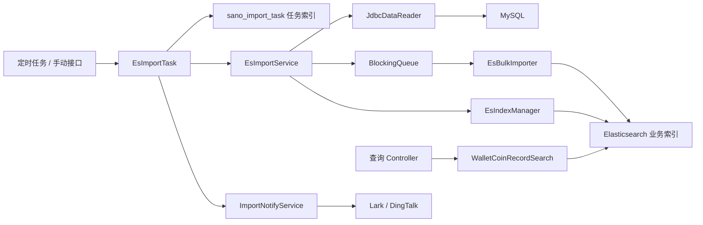

# ES数据服务设计文档

## 1. 文档说明

本文档整理 `es-server` 当前实现，用于说明 ES 数据同步服务的设计目标、模块职责、导入流程、任务状态、日志监控、查询接口和后续扩展方向。

本文档只描述当前项目最终实现，不删除或替换历史文档。历史文档包括 `xuqiu.md`、`数据中台设计文档.md`、`迭代.md`、`部署.md`。

## 2. 项目定位

`es-server` 是数据中台中的 ES 数据服务，当前主要承担两类能力：

1. 将 MySQL 中按天产生的钱包流水类数据同步到 Elasticsearch。
2. 对同步后的 ES 索引提供轻量查询和统计接口。

当前系统优先满足单台服务器 Docker 部署、单节点 Elasticsearch、T+1 定时同步、多表串行导入、失败可观测、任务可断点续跑的业务场景。

## 3. 当前目标

### 3.1 已实现目标

- 支持多张表按天同步到 ES。
- 支持每天定时创建导入任务，并串行执行待处理任务。
- 支持手动补指定日期或指定日期段数据。
- 支持任务状态落入 ES 任务索引，避免纯内存任务丢失。
- 支持同步超时暂停，下一次调度从上次成功 ID 继续。
- 支持 Bulk 写入重试、失败 ID 独立日志、导入结果通知。
- 支持按表配置历史索引保留策略。
- 支持导入日志、失败日志、查询 API 日志分文件输出。
- 支持 Docker 镜像构建、Compose 部署、Linux 自动部署脚本。

### 3.2 当前非目标

- 当前不是分布式导入调度系统。
- 当前不使用 Kafka、MQ、Flink 等实时链路。
- 当前不做 MySQL Binlog 增量订阅。
- 当前不支持多实例同时抢占同一任务。
- 当前查询接口属于内部服务，参数上限主要通过调用约定控制。

## 4. 技术栈

| 类别 | 技术 |
| --- | --- |
| 运行环境 | Java 21 |
| 应用框架 | Spring Boot 3.5.x |
| 数据库访问 | Spring JDBC、HikariCP |
| ES 客户端 | Elasticsearch Java Client 8.x |
| JSON | Jackson |
| 日志 | Logback |
| 容器化 | Docker、Docker Compose |
| 镜像运行时 | eclipse-temurin:21-jre-jammy |

## 5. 总体架构



## 6. 代码模块

### 6.1 核心包结构

```text
com.tsd.sano.es
├── controller
│   ├── EsImportController          # 导入任务接口
│   ├── HealthController            # Docker 健康检查接口
│   └── sta                         # 查询统计接口
├── core
│   ├── config                      # ES Client、异步线程池、CORS、Redis 配置
│   ├── exception                   # 统一异常
│   ├── result                      # 统一响应
│   └── util                        # 时间、ES 日期序列化工具
├── importer
│   ├── notify                      # 导入结果通知
│   ├── pipeline                    # MySQL 读取、ES 写入、索引管理主链路
│   ├── task                        # 定时任务和手动任务调度
│   ├── taskstore                   # ES 任务索引读写
│   └── util                        # Mapping 加载
└── search                          # ES 查询能力
```

### 6.2 importer/pipeline

| 类 | 职责 |
| --- | --- |
| `EsImportService` | 单个表、单个业务日期的完整导入流程编排 |
| `JdbcDataReader` | MySQL count 和分页读取，读取结果写入队列 |
| `EsBulkImporter` | 消费队列并 Bulk 写入 ES |
| `EsIndexManager` | 创建索引、调整导入期参数、刷新、绑定 alias、清理历史索引 |
| `EsImportProperties` | `sano.es.import` 配置映射 |
| `EsImportConfig` | 单次导入任务的运行配置 |
| `ImportContext` | 单次导入任务上下文 |
| `ImportStatistics` | 单次导入统计数据 |

### 6.3 importer/task

`EsImportTask` 负责每天调度和手动补数据：

- 定时任务每天触发一次。
- 先修复过期的 `RUNNING` 任务。
- 为当天需要导入的业务日期创建所有启用表的 `PENDING` 任务。
- 循环拉取待处理任务执行。
- 达到本轮最大运行时长后，不再启动新的任务。
- 已经读取出来的数据会继续写入 ES，不会因为到达时间阈值而丢弃。

### 6.4 importer/taskstore

任务状态存储在 ES 索引 `sano_import_task` 中。

| 类 | 职责 |
| --- | --- |
| `SanoImportTaskService` | 创建任务索引、创建任务、更新任务、查询待处理任务、查询运行中任务 |
| `SanoImportTask` | 任务文档模型 |
| `SanoImportTaskStatus` | 任务状态枚举 |

### 6.5 importer/notify

导入任务结束后发送通知。当前支持：

- Lark / 飞书机器人。
- DingTalk / 钉钉机器人。

通知属于辅助链路，通知失败不会影响导入任务状态。

### 6.6 search

当前查询能力主要围绕金币记录表：

| 类 | 职责 |
| --- | --- |
| `WalletCoinRecordSearch` | 金币记录统计和明细查询 |
| `EsIndexAlias` | ES alias 常量 |
| `EsConstant` | ES 查询常量 |
| `EsSearchUtil` | 查询辅助工具 |

## 7. 导入数据模型

### 7.1 当前业务表

| MySQL 表 | ES alias | Mapping 文件 |
| --- | --- | --- |
| `sano_wallet_coin_record` | `sano_wallet_coin_record` | `sano_wallet_coin_record.json` |
| `sano_wallet_diamond_record` | `sano_wallet_diamond_record` | `sano_wallet_diamond_record.json` |
| `sano_wallet_lucky_diamond_record_10m` | `sano_wallet_lucky_diamond_record_10m` | `sano_wallet_lucky_diamond_record_10m.json` |

### 7.2 索引命名

业务索引使用按天物理索引：

```text
{index_alias}_{yyyyMMdd}
```

示例：

```text
sano_wallet_coin_record_20260703
```

查询侧使用 alias：

```text
sano_wallet_coin_record
```

### 7.3 Alias 策略

当前 `switchAlias` 只将当前物理索引添加到 alias，不主动移除其他历史索引上的同名 alias。

这样做的原因是：历史日期索引仍可能被查询使用，不能在导入某一天完成后把未过期历史索引从 alias 中移除。

### 7.4 历史索引清理

历史索引清理按表配置：

```yaml
tables:
  - index-alias: sano_wallet_coin_record
    delete-history-index: true
    reserve-days: 60
```

清理逻辑：

1. 以当前导入业务日期 `importDate` 为基准。
2. 计算 `importDate - reserveDays` 对应的唯一过期索引名。
3. 如果该索引存在，则删除。
4. 如果不存在，则跳过。

当前实现不会扫描 `alias_*` 全部索引，避免在历史索引很多时产生额外 ES 压力。

空数据任务也会触发历史索引清理，因为该业务日期本身无需创建新索引，但历史保留策略仍应该继续推进。

## 8. 导入任务索引

### 8.1 索引名称

```text
sano_import_task
```

该索引用于保存导入任务状态，属于任务控制数据，不是业务流水数据。

### 8.2 任务 ID

任务 ID 由表名和业务日期组成：

```text
{table_name}_{yyyyMMdd}
```

示例：

```text
sano_wallet_coin_record_20260703
```

每张表每天理想状态下只有一条任务记录。

### 8.3 主要字段

| 字段 | 含义 |
| --- | --- |
| `task_id` | 任务 ID |
| `table_name` | MySQL 表名 |
| `index_alias` | ES alias |
| `index_name` | ES 物理索引名 |
| `import_date` | 业务日期，格式 `yyyyMMdd` |
| `status` | 任务状态 |
| `last_success_id` | 已成功写入 ES 的最大 MySQL ID |
| `total_count` | 数据源总数 |
| `success_count` | 累计成功数 |
| `failed_count` | 累计失败数 |
| `run_count` | 执行次数 |
| `last_error` | 最近一次错误 |
| `started_at` | 最近一次开始时间 |
| `finished_at` | 最近一次结束时间 |
| `created_at` | 创建时间 |
| `updated_at` | 更新时间 |

### 8.4 任务状态

| 状态 | 含义 |
| --- | --- |
| `PENDING` | 已创建，等待执行 |
| `RUNNING` | 正在执行 |
| `TIMEOUT_PARTIAL` | 本轮达到最大运行时长，已部分完成，等待下次续跑 |
| `SUCCESS` | 已完成 |
| `FAILED` | 执行失败，需要排查 |

## 9. 导入流程

### 9.1 每日定时流程

```text
每天定时触发
  -> 修复超时 RUNNING 任务
  -> 创建昨天所有启用表的 PENDING 任务
  -> while 未达到本轮运行时间上限:
       拉取一批 PENDING / TIMEOUT_PARTIAL 任务
       没有任务则结束
       逐条执行任务
       每条任务执行前检查是否到达 deadline
```

### 9.2 手动补数据流程

接口支持指定一天或指定日期段：

```text
GET /import/importAppointDay?date=20260703
GET /import/importDateRange?startDate=20260701&endDate=20260705
```

手动补数据不会绕过任务系统。接口只负责创建对应日期范围的任务，然后仍然交给统一任务流程串行执行。

### 9.3 单任务执行流程

```text
开始执行任务
  -> 状态更新为 RUNNING
  -> 计算本轮 deadline_millis
  -> 判断是否续跑
  -> PENDING：创建新索引，从 last_success_id=0 开始
  -> TIMEOUT_PARTIAL：复用已有索引，从 last_success_id 继续
  -> MySQL count
  -> 每次查询下一页 MySQL 前检查 deadline
  -> 未超时：读取 MySQL，写入 Bulk 队列
  -> Bulk 成功后推进 last_success_id
  -> 全部读取完成：恢复索引参数、refresh、绑定 alias、清理历史索引、状态改为 SUCCESS
  -> 到达 deadline：停止继续读取 MySQL，等待已入队数据写完，状态改为 TIMEOUT_PARTIAL
  -> 发生异常：状态改为 FAILED
```

### 9.4 空数据处理

当某张表某一天数据源总数为 0：

- 不创建业务索引。
- 不认为任务失败。
- 任务状态更新为 `SUCCESS`。
- 仍会执行该表的历史索引清理策略。
- 日志使用 `INFO/WARN` 级别提示无数据。

## 10. MySQL 读取设计

### 10.1 查询条件

如果表配置没有显式设置 `where-sql`，默认使用：

```sql
dt = ?
```

读取时使用主键游标：

```sql
SELECT *
FROM table_name
WHERE dt = ?
  AND id > ?
ORDER BY id ASC
LIMIT ?
```

### 10.2 分页方式

当前采用 keyset pagination，不使用 `OFFSET`。

优点：

- 大页数场景不会因为 `OFFSET` 越大越慢。
- 可通过 `last_success_id` 支持续跑。
- 适合 `dt,id` 联合索引场景。

### 10.3 连接占用

MySQL 读取通过 `JdbcTemplate` 执行，每次查询使用连接池连接，查询结束后连接归还 HikariCP。

当前生产配置将 Hikari 最大连接数限制为 5，避免导入服务误占用过多数据库连接。

### 10.4 Deadline 检查

系统只在准备查询下一页 MySQL 前检查 deadline。

如果一页数据已经从 MySQL 读出，会继续写入 ES，不会因为到达时间上限而丢弃已读取数据。这样可以减少数据库无效读取，也保证续跑点准确。

## 11. ES Bulk 写入设计

### 11.1 队列模型

导入链路使用有界 `BlockingQueue`：

```text
JdbcDataReader -> BlockingQueue -> EsBulkImporter
```

当 ES 写入变慢时，队列会逐渐填满，MySQL 读取线程会被阻塞，从而形成自然背压。

### 11.2 Bulk 拆分

Bulk 请求同时受两个条件控制：

- `bulk-actions`：单次 Bulk 文档数。
- `bulk-size-mb`：单次 Bulk 估算大小。

文档体积估算使用首条记录估算，并带安全系数。当前业务表单条记录结构差异不大，这样可以减少每条数据重复遍历带来的额外开销。

### 11.3 重试策略

请求级异常会按 `retry-times` 和 `retry-interval` 重试。

文档级失败不会重试整个批次，而是记录失败 ID、错误原因，并累计失败数。

### 11.4 失败阈值

导入完成后会检查：

- `max-failed-documents`
- `max-failure-rate`

如果失败数或失败率超过阈值，任务失败，不绑定 alias，避免错误索引进入查询链路。

### 11.5 失败 ID 日志

失败 ID 独立输出到：

```text
{LOG_DIR}/{yyyyMMdd}/es-server-import-error.log
```

日志会包含表名和 ID，便于回查 MySQL 原始数据。

## 12. 索引管理设计

### 12.1 创建索引

业务索引根据 `esmapping` 目录下的 JSON 文件创建。

当前 Mapping 文件：

```text
src/main/resources/esmapping/sano_wallet_coin_record.json
src/main/resources/esmapping/sano_wallet_diamond_record.json
src/main/resources/esmapping/sano_wallet_lucky_diamond_record_10m.json
src/main/resources/esmapping/sano_import_task.json
```

### 12.2 导入期优化

导入前可临时调整：

- `refresh_interval = -1`
- `number_of_replicas = 0`

单节点 ES 环境下副本建议保持 0。

### 12.3 导入完成处理

成功完成后：

1. 恢复 `refresh_interval`。
2. 恢复副本配置。
3. refresh 当前索引。
4. 为当前索引添加 alias。
5. 按表级策略清理一个过期历史索引。

### 12.4 严格 Mapping

当前业务 Mapping 使用严格模式，避免未知字段静默写入 ES。

优点：

- 字段变更可以尽早暴露。
- 避免脏字段污染索引结构。

注意：

- MySQL 表结构新增字段后，如果继续 `SELECT *`，需要同步更新 Mapping。
- 若 Mapping 未更新，Bulk 会出现文档级失败。

## 13. 日志设计

### 13.1 日志目录

日志按日期分目录：

```text
{LOG_DIR}/{yyyyMMdd}/
```

Docker 默认挂载到：

```text
./logs:/app/logs/es-server
```

### 13.2 日志文件

| 文件 | 用途 |
| --- | --- |
| `es-server.log` | 全量应用日志 |
| `es-server-error.log` | ERROR 级别日志 |
| `es-server-import.log` | 导入任务日志 |
| `es-server-import-error.log` | 导入失败 ID 日志 |
| `es-server-search-api.log` | 查询 API 日志 |

### 13.3 编码

Logback 文件输出统一使用 UTF-8。

如果服务器终端看到中文乱码，通常是查看工具或终端编码问题，不代表日志文件内容一定异常。

### 13.4 导入关键日志

重点关注：

- `ES-Import scheduled start`
- `ES-Import task added`
- `ES-Import start`
- `ES-Import count sql`
- `ES-Import mysql page query`
- `ES-Import read batch`
- `ES-Import bulk progress`
- `ES-Import slow bulk`
- `ES-Import success`
- `ES-Import timeout partial`
- `ES-Import failed`

## 14. 通知设计

### 14.1 通知触发

每个任务结束后发送一条结果通知。

支持三种结果：

- 成功通知。
- 失败通知。
- 超时暂停通知。

### 14.2 通知渠道

当前实现：

- Lark / 飞书机器人。
- DingTalk / 钉钉机器人。

配置示例：

```yaml
sano:
  es:
    import:
      notify:
        enabled: true
        success-enabled: true
        failure-enabled: true
        timeout-enabled: true
        subject-prefix: "[SANO-ES-PROD]"
        channels:
          lark:
            enabled: true
            webhook-url: ${LARK_WEBHOOK_URL:}
            secret: ${LARK_WEBHOOK_SECRET:}
          dingtalk:
            enabled: false
            webhook-url: ${DINGTALK_WEBHOOK_URL:}
            secret: ${DINGTALK_WEBHOOK_SECRET:}
```

### 14.3 通知可靠性边界

通知是旁路能力。

通知构建、渠道发送、Webhook 响应异常都会被捕获并记录日志，不会改变导入任务状态。

## 15. 查询接口设计

### 15.1 周统计接口

```text
POST /walletCoin/staCoinWeek
```

用途：

- 按房间 ID 集合和时间范围统计金币消费。
- 使用 ES 聚合计算消费用户数、消费总金币、幸运礼物、游戏金币等指标。

### 15.2 金币明细接口

```text
POST /walletCoin/searchCoinRecords
```

用途：

- 按用户、业务类型、时间范围查询金币明细。
- 使用 `create_time desc, id desc` 排序。
- 使用 `search_after` 支持深度分页。

请求示例：

```json
{
  "userId": 52748786,
  "businessType": 11,
  "startTime": "2026-06-29 00:00:00",
  "endTime": "2026-07-05 23:59:59",
  "pageSize": 50,
  "lastCreateTime": null,
  "lastId": null
}
```

下一页请求传入上一页最后一条的 `createTime` 和 `id`。

## 16. 配置说明

### 16.1 核心配置路径

```text
src/main/resources/application.yml
src/main/resources/application-dev.yml
src/main/resources/application-prod.yml
src/main/resources/logback-spring.xml
```

### 16.2 导入配置

| 配置 | 含义 |
| --- | --- |
| `task-enabled` | 是否开启定时导入任务 |
| `cron` | 每日调度表达式 |
| `max-run-minutes` | 每轮调度最大运行分钟数 |
| `task-fetch-limit` | 每轮从任务索引拉取的任务数量 |
| `read-batch-size` | MySQL 每页读取数量 |
| `worker-count` | ES Bulk 写入线程数 |
| `queue-capacity` | MySQL 读取到 ES 写入之间的队列容量 |
| `bulk-actions` | 单次 Bulk 最大文档数 |
| `bulk-size-mb` | 单次 Bulk 最大估算大小 |
| `retry-times` | Bulk 请求级失败最大重试次数 |
| `retry-interval` | 重试间隔毫秒 |
| `max-failed-documents` | 允许失败文档数阈值 |
| `max-failure-rate` | 允许失败率阈值 |
| `disable-refresh` | 导入期间是否关闭 refresh |
| `disable-replica` | 导入期间是否关闭副本 |

### 16.3 表配置

| 配置 | 含义 |
| --- | --- |
| `enabled` | 是否启用该表导入 |
| `index-alias` | ES alias |
| `table-name` | MySQL 表名 |
| `mapping-file` | Mapping JSON 文件 |
| `delete-history-index` | 是否删除该表历史索引 |
| `reserve-days` | 该表历史索引保留天数 |
| `id-column` | 游标 ID 字段 |
| `dt-column` | 日期字段 |
| `where-sql` | 自定义 where 条件，为空则使用 `dt = importDate` |

## 17. 稳定性设计

### 17.1 防重复执行

单 JVM 内使用运行中 key 避免同一个 alias、index、table、date 重复导入。

任务调度入口使用 `AtomicBoolean` 避免同一实例内定时任务和手动任务并发调度。

### 17.2 断点续跑

任务超时后状态为 `TIMEOUT_PARTIAL`。

下一次执行时：

- 复用已有索引。
- 从 `last_success_id` 继续读取。
- 不重复创建索引。

### 17.3 异常处理

- 单条文档失败只记录失败 ID，不直接中断整个 Bulk。
- 请求级 Bulk 失败会重试。
- 超过失败阈值后任务失败，不切换 alias。
- 通知失败不影响导入任务。
- 过期 `RUNNING` 任务会在下一次调度前修复为 `TIMEOUT_PARTIAL`。

### 17.4 背压控制

有界队列可以限制内存占用。

当 ES 写入慢时，MySQL 读取会自然放慢，避免无限制读取数据到内存。

## 18. 性能设计

### 18.1 当前生产参数取向

当前生产配置偏稳健：

- MySQL 每页读取约 15000 条。
- ES Bulk 每批约 3000 条或约 8MB。
- Bulk 写入线程 4 个。
- 队列容量 16。
- Hikari 最大连接数 5。

这些参数适合 8 核 16G 单机、单节点 ES、同时预留部分资源给其他服务的部署模型。

### 18.2 主要瓶颈判断

通过日志可以区分瓶颈：

| 现象 | 可能瓶颈 |
| --- | --- |
| `mysql page query costMs` 长期较高 | MySQL 查询、网络链路、数据库负载 |
| `slow bulk` 频繁出现 | ES 写入、磁盘、refresh、merge、GC |
| 队列长期满 | ES 写入速度低于 MySQL 读取速度 |
| CPU 长期超过 80% | ES 写入或查询压力过高 |
| JVM GC 明显 | 堆内存或 Bulk 批次过大 |

### 18.3 扩展建议

当前单实例串行导入更稳。

如果后续要多表同时导入，需要重点补齐：

- 任务抢占机制，避免多个实例执行同一任务。
- 按表或按任务控制并发数。
- 单节点 ES 写入能力评估。
- MySQL 连接池和查询压力评估。
- 通知与日志按任务维度增强追踪。

## 19. 部署资源建议

当前 8 核 16G 单服务器建议：

| 服务 | CPU | 内存 |
| --- | --- | --- |
| Elasticsearch | 约 4 核 | 容器 8G，堆 4G |
| es-server | 约 2 核 | 容器 2G，堆 1G-1.5G |
| 系统和其他服务 | 预留 2 核左右 | 预留 4G-6G |

如果未来仍然保持单节点 ES，但导入和查询压力显著增加，优先考虑：

1. 将 MySQL、ES、es-server 分散到独立机器。
2. 增大 ES 所在机器的 CPU、内存和磁盘 IO。
3. 再考虑应用层并行导入。

## 20. 安全与配置约定

当前服务按内部服务设计，但生产仍建议：

- 密码、Webhook、Secret 通过环境变量注入。
- Docker 网络只暴露必要端口。
- ES 账号只授予必要索引权限。
- `sano_import_task` 不应被历史索引清理策略误删。
- `logs` 目录需要正确授权给容器运行用户。

## 21. 已知边界

- 当前任务锁是单 JVM 内锁，不是分布式锁。
- 如果部署多个 es-server 实例，需要增加 ES 任务抢占更新逻辑。
- 任务索引保存在同一个 ES 中，ES 不可用时任务调度也不可用。
- 业务 Mapping 使用严格模式，MySQL 新增字段后需要同步维护 Mapping。
- 查询接口当前适合内部调用，不承担公网开放 API 的完整防护职责。

## 22. 后续迭代方向

优先级较高的后续方向：

1. 增加任务抢占机制，支持多实例安全部署。
2. 增加查询接口慢查询阈值和请求摘要。
3. 增加导入任务详情查询接口。
4. 增加失败任务重试接口。
5. 增加任务通知聚合报表，例如每天整体完成情况。
6. 根据真实查询模式评估是否需要按表增加专用索引排序或拆分 alias。
