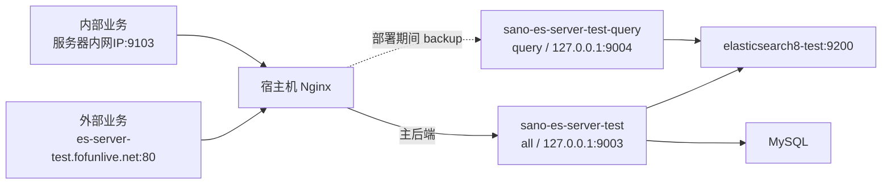

# es-server 版本A部署文档

## 1. 文档说明

本文档用于部署和运维 `es-server` 版本A，重点说明测试环境从旧版本首次升级、后续无感安全升级、Nginx 查询接管、严格就绪检查和自动回滚。

本文档是新增文档，不替代原有的 `部署文档.md`。原文档中的 Elasticsearch 安装、宿主机系统参数和基础 Docker 运维内容继续有效；部署流程与本文档冲突时，版本A的 `es-server` 发布以本文档和当前源码为准。

当前验证基线：

- 文档日期：2026-07-19。
- 测试环境 Nginx 配置 `es-server/nginx/es-server-test.conf.example` 已在服务器连续运行两天。
- 测试环境常驻容器使用 `all` 模式。
- `query` 容器只在 `safe` 部署期间临时启动。
- T+1 同步可用。
- 延迟轮询引擎仍未实现，版本A必须保持关闭。

## 2. 版本A能力边界

版本A包含：

- 同一镜像支持 `all`、`query` 两种运行角色。
- `all` 实例同时承担查询和 T+1 同步。
- `query` 实例开放查询，但关闭 T+1、Polling 及同步调度能力。
- `/health` 存活检查和 `/ready` 严格就绪检查。
- 统一 drain、cancel 和 drain/status 协议。
- 部署前排空 Reader、队列、Bulk 和活动任务。
- Nginx 主备查询接管。
- 新版本失败后自动恢复原版本。
- Compose 客户端卡住时的独立超时保护。

版本A不包含 Polling 延迟同步引擎、Polling checkpoint 和 Polling 租约。因此必须满足：

```text
SANO_ES_POLLING_ENABLED=false
```

所有已启用表必须继续配置为：

```yaml
sync-mode: t-plus-one
```

## 3. 测试环境部署拓扑



端口和职责：

| 地址或端口 | 用途 | 常驻 |
| --- | --- | --- |
| `es-server-test.fofunlive.net:80` | 外部业务访问 `es-server` | 是 |
| `服务器内网IP:9103` | 内部业务访问 `es-server` | 是 |
| `0.0.0.0:9003` | Docker `all` 实例宿主机端口 | 是 |
| `0.0.0.0:9004` | Docker `query` 实例宿主机端口，只在 safe 部署期间存在 | 否 |
| `es-test.fofunlive.net:80` | 测试 Elasticsearch 外部代理，转发到 `127.0.0.1:9211` | 是 |

外部业务继续使用原域名，不需要因发布方式变化而修改。内部业务优先使用 `服务器内网IP:9103`；Docker 后端端口9003和9004虽然已监听全部网络接口，但业务不应直接依赖部署期间会启停的临时 query 端口9004。

## 4. 文件和目录

本地项目目录：

```text
C:\work\opts\sano\code\datahub\es-server
```

测试服务器目录：

```text
/home/ec2-user/datahub-test/es-server
```

版本A测试环境必需文件：

```text
es-server
├── deploy-es-server-test.sh
├── docker-compose-test.yml
├── nginx
│   └── es-server-test.conf.example
├── logs-test
└── logs-test-query
```

说明：

- `deploy-es-server-test.sh` 是完整独立脚本，不依赖正式环境的 `deploy-es-server.sh`。
- `docker-compose-test.yml` 同时定义常驻 `all` 服务和临时 `query` 服务。
- `logs-test` 保存 `all` 实例日志。
- `logs-test-query` 保存临时 `query` 实例日志。
- 部署脚本会创建日志目录并尝试授权给容器用户 `10001:10001`。

## 5. Nginx 配置

### 5.1 配置基准

测试环境完整配置以以下文件为唯一基准：

```text
es-server/nginx/es-server-test.conf.example
```

不要在部署文档中维护第二份 Nginx 配置，避免端口、域名或超时参数不一致。

配置包含三个入口：

1. `es-server-test.fofunlive.net:80`：外部业务查询入口。
2. `0.0.0.0:9103`：内部业务查询入口。
3. `es-test.fofunlive.net:80`：测试 Elasticsearch 代理入口。

前两个入口共用 `upstream es_server_test_query_backend`：

- `127.0.0.1:9003` 是主后端。
- `127.0.0.1:9004` 是 `backup` 后端。
- 平时 9004 没有容器监听属于正常状态。
- safe 部署时先启动 9004，停止 9003 后 Nginx 自动改用 9004。
- 新 9003 恢复后，Nginx 自动重新使用主后端，不需要动态修改 upstream。

### 5.2 首次安装或更新配置

服务器已有正确配置时不要重复覆盖。确需更新且目标文件已经存在时先备份：

```bash
if [ -f /etc/nginx/conf.d/es-server-test.conf ]; then
  sudo cp /etc/nginx/conf.d/es-server-test.conf \
    /etc/nginx/conf.d/es-server-test.conf.bak-$(date +%Y%m%d%H%M%S)
fi
```

安装仓库中的基准配置：

```bash
cd /home/ec2-user/datahub-test/es-server
sudo install -m 0644 nginx/es-server-test.conf.example \
  /etc/nginx/conf.d/es-server-test.conf
sudo nginx -t
sudo systemctl reload nginx
```

检查监听和入口：

```bash
sudo ss -lntp | grep -E ':(80|9103)\b'
curl -fsS http://127.0.0.1:9103/health
curl -fsS http://es-server-test.fofunlive.net/health
```

## 6. 部署前准备

### 6.1 工具和网络

```bash
docker version
docker compose version || docker-compose version
command -v curl
command -v jq
command -v timeout
docker network inspect sano-net
```

部署脚本依赖 Docker、Compose、curl、jq、GNU timeout，以及常规 Linux 工具 awk、sed、sort。`sano-net` 不存在时脚本会自动创建。

### 6.2 上传并检查部署文件

服务器至少需要更新：

```text
deploy-es-server-test.sh
docker-compose-test.yml
```

检查：

```bash
cd /home/ec2-user/datahub-test/es-server
chmod +x deploy-es-server-test.sh
bash -n deploy-es-server-test.sh
docker compose -f docker-compose-test.yml config --quiet \
  || docker-compose -f docker-compose-test.yml config --quiet
```

### 6.3 配置要求

确认：

- 常驻实例 `SPRING_PROFILES_ACTIVE=test`、`SANO_SERVER_MODE=all`。
- 临时实例 `SANO_SERVER_MODE=query`。
- 常驻实例 T+1 开启，临时实例 T+1 关闭。
- 两种实例 Polling 均关闭。
- 所有版本A表仍是 `sync-mode: t-plus-one`。
- MySQL、ES 用户名和密码按服务器实际环境注入。

## 7. 构建和推送镜像

版本标签必须使用明确版本号，不要使用 `latest` 执行服务器部署。版本标签发布后保持不可变；修复内容使用新版本，例如从 v1.0.8 升级为 v1.0.9。

Windows：

```bat
cd C:\work\opts\sano\code\datahub\es-server
docker-build.bat v1.0.9 --push
```

Linux 或 macOS：

```bash
./docker-build.sh v1.0.9 --push
```

构建脚本会构建 jar，使用 buildx 推送 amd64/arm64 镜像，并同时更新 `latest`。服务器部署仍必须显式指定：

```text
ES_SERVER_IMAGE_TAG=v1.0.9
```

## 8. 部署模式选择

| 场景 | 模式 | query 接管 | 使用要求 |
| --- | --- | --- | --- |
| 旧镜像首次升级到版本A | `legacy` | 否 | 仅一次 |
| 没有旧容器的首次安装 | `legacy` | 否 | 首次安装 |
| 版本A升级到后续版本 | `safe` | 是 | 日常发布 |
| 相同版本安全流程演练 | `safe` | 是 | 可选，不建议频繁执行 |

旧版本没有 `/ready`、drain 和 query 模式时只能使用 `legacy`。当前实例已经是 v1.0.8 或更高版本A后，必须使用 `safe`，不能为了绕过前置检查重新使用 `legacy`。

## 9. 首次升级到版本A

仅用于旧版本首次升级到版本A，例如 v1.0.7 升级到 v1.0.8。旧版本不具备 query 接管和统一 drain，本次存在受控查询维护窗口。

执行：

```bash
cd /home/ec2-user/datahub-test/es-server
ES_SERVER_IMAGE_TAG=v1.0.8 DEPLOY_MODE=legacy ./deploy-es-server-test.sh
```

`NGINX_HANDOFF_PRECONFIGURED` 在 legacy 模式下不参与判断。

legacy 流程：

1. 获取旧容器镜像 ID 和原镜像标签。
2. 准备可回滚的旧镜像引用。
3. 拉取目标版本镜像。
4. 停止并删除旧测试主容器。
5. 启动新 `all` 容器。
6. 检查 `/health`。
7. 检查 `/ready=true`、`serviceMode=ALL`。
8. 观察20秒，确认容器没有重启。
9. 检查同步协调器为 `RUNNING`。

首次升级成功后，后续发布必须改用 `safe`。

## 10. 后续 safe 安全部署

### 10.1 标准命令

例如从 v1.0.8 升级到 v1.0.9：

```bash
cd /home/ec2-user/datahub-test/es-server
ES_SERVER_IMAGE_TAG=v1.0.9 DEPLOY_MODE=safe NGINX_HANDOFF_PRECONFIGURED=true ./deploy-es-server-test.sh
```

多行写法：

```bash
ES_SERVER_IMAGE_TAG=v1.0.9 \
DEPLOY_MODE=safe \
NGINX_HANDOFF_PRECONFIGURED=true \
./deploy-es-server-test.sh
```

`NGINX_HANDOFF_PRECONFIGURED=true` 表示运维已确认当前 Nginx 基准配置生效。它不会修改 Nginx，也不会传入 Java 容器，只用于允许脚本进入 query 接管流程。

不希望每次输入时，可以在当前发布会话设置：

```bash
export NGINX_HANDOFF_PRECONFIGURED=true
```

不建议把脚本默认值改为 `true`，否则换服务器或 Nginx 配置缺失时可能失去部署前保护。

### 10.2 safe 完整流程

1. 获取当前 `all` 容器的镜像引用和镜像 ID。
2. 检查旧实例 `/ready=true` 且 `serviceMode=ALL`。
3. 检查旧实例 drain 协议和协调器状态。
4. 确认 Nginx 已配置 9004 backup。
5. 复用可信原版本标签作为回滚镜像。
6. 启动同一旧镜像的临时 `query` 容器，监听宿主机全部网络接口的9004端口。
7. 验证临时实例 `/ready=true` 且 `serviceMode=QUERY`。
8. 拉取目标镜像。
9. 请求旧 `all` 实例进入 drain。
10. 等待 Reader、队列、Bulk 和活动任务安全排空。
11. 停止并删除旧 `all` 容器。
12. 通过外部域名和内部 9103 冒烟，此时查询由 9004 承接。
13. 启动目标版本 `all` 容器，监听宿主机全部网络接口的9003端口。
14. 验证 `/ready=true`、`serviceMode=ALL` 和同步协调器 `RUNNING`。
15. 再次通过外部域名和内部 9103 冒烟。
16. 停止并删除临时 `query` 容器。

成功后的最终状态只有：

```text
sano-es-server-test        all        0.0.0.0:9003
```

正常情况下不应保留：

```text
sano-es-server-test-query  query      0.0.0.0:9004
```

### 10.3 相同版本 safe 演练

可以用当前版本演练完整接管流程：

```bash
ES_SERVER_IMAGE_TAG=v1.0.8 DEPLOY_MODE=safe NGINX_HANDOFF_PRECONFIGURED=true ./deploy-es-server-test.sh
```

由于源标签和目标标签相同，拉取操作可能改变标签指向，脚本会按需创建：

```text
test-rollback-v1.0.8-20260719120000
```

正常的 v1.0.8 到 v1.0.9 升级会直接复用 v1.0.8，不额外创建安全标签。

## 11. 部署参数

| 参数 | 默认值 | 说明 |
| --- | --- | --- |
| `ES_SERVER_IMAGE` | `lxw13000/sano-es-server` | 镜像仓库 |
| `ES_SERVER_IMAGE_TAG` | `latest` | 目标标签，发布时必须显式指定版本 |
| `DEPLOY_MODE` | `safe` | `safe` 或 `legacy` |
| `NGINX_HANDOFF_PRECONFIGURED` | `false` | safe 模式下确认 Nginx 主备配置已生效 |
| `SYNC_API_TOKEN` | 脚本默认值 | 内部接口 Token，建议通过环境变量管理 |
| `COMPOSE_UP_TIMEOUT` | `30` | Compose detached 启动命令超时秒数 |
| `START_TIMEOUT` | `180` | 单个容器严格就绪超时秒数 |
| `DRAIN_TIMEOUT` | `600` | drain 最长等待秒数 |
| `STABLE_SECONDS` | `20` | 严格就绪后无重启观察时间 |
| `PUBLIC_QUERY_BASE_URL` | `http://es-server-test.fofunlive.net` | 外部 Nginx 冒烟地址 |
| `INTERNAL_QUERY_BASE_URL` | `http://127.0.0.1:9103` | 部署机本地访问内部 Nginx 入口 |
| `NGINX_SMOKE_COMMAND` | 两个地址的 `/ready` | 可替换为真实业务查询命令 |
| `POST_START_SYNC_CHECK_COMMAND` | 空 | 版本B扩展检查，版本A保持为空 |

内部业务使用 `服务器内网IP:9103`；部署脚本运行在同一服务器，所以默认以 `127.0.0.1:9103` 验证同一个 Nginx 监听端口是正确的。

## 12. 部署后验证

### 12.1 容器与临时实例

```bash
docker ps --filter name=sano-es-server-test
docker inspect sano-es-server-test \
  --format 'image={{.Config.Image}} status={{.State.Status}} health={{.State.Health.Status}} restart={{.RestartCount}}'
docker ps -a --format '{{.Names}}\t{{.Image}}\t{{.Status}}' \
  | grep '^sano-es-server-test-query' || true
```

期望主容器是目标版本、`running`、`healthy`、`restart=0`，并且临时 query 查询无输出。

### 12.2 三条访问路径

```bash
curl -fsS http://127.0.0.1:9003/health
curl -fsS http://127.0.0.1:9103/health
curl -fsS http://es-server-test.fofunlive.net/health
```

### 12.3 严格就绪

从部署脚本取得 Token，命令不会打印 Token：

```bash
TOKEN=$(grep '^SYNC_API_TOKEN=' deploy-es-server-test.sh \
  | sed 's/.*:-//;s/}"$//')
curl -sS -H "token: ${TOKEN}" http://127.0.0.1:9003/ready | jq .
```

期望关键字段：

```json
{
  "ready": true,
  "serviceMode": "ALL",
  "queryReady": true,
  "syncReady": true
}
```

`details` 应说明真实业务 Alias 可查；T+1 开启时还应说明任务索引可用。

### 12.4 同步协调器

```bash
curl -sS -H "token: ${TOKEN}" \
  http://127.0.0.1:9003/internal/sync/drain/status | jq .
```

期望：

```text
code=200
data.serviceMode=ALL
data.coordinatorState=RUNNING
data.drainResult=NOT_STARTED 或已完成终态
```

空闲时还应满足 `activeTask=false`、`queueSize=0`、`activeBulk=0`、`waitingBulkPermit=0` 和 `resources.memory.usedBytes=0`。

### 12.5 日志

```bash
docker logs --tail 200 sano-es-server-test
tail -f logs-test/$(date +%Y%m%d)/es-server.log
tail -f logs-test/$(date +%Y%m%d)/es-server-import.log
tail -f logs-test/$(date +%Y%m%d)/es-server-import-error.log
```

## 13. 自动回滚行为

### 13.1 主容器替换前失败

旧版本预检、Nginx 确认、query 就绪、镜像拉取或 drain 失败时，脚本会取消 drain、恢复中断任务、清理临时 query，原 `all` 容器继续运行。

### 13.2 主容器替换后失败

新容器启动、严格就绪、模式、协调器或 Nginx 冒烟失败时，脚本会：

1. 删除失败的新主容器。
2. 使用原版本标签恢复旧主容器。
3. 原标签缺失或漂移时，按需创建带来源版本的安全标签再恢复。
4. 尽量保留 query 容器，等待人工确认旧主恢复后清理。

例如 v1.0.8 升级 v1.0.9 失败，正常恢复：

```text
lxw13000/sano-es-server:v1.0.8
```

### 13.3 中断部署终端

脚本捕获 `Ctrl+C`、TERM 和异常退出并执行退出保护。不要因为 Compose 已显示 `Started` 就立即中断；后面还有严格就绪、稳定观察和协调器检查。确需中断时，应预期自动回滚，并在另一个终端观察容器和日志。

## 14. 镜像和回滚标签管理

### 14.1 正常升级不创建额外标签

从 v1.0.8 升级 v1.0.9 时，如果 v1.0.8 仍指向当前镜像，脚本直接复用 v1.0.8，不创建时间戳标签。

以下情况才创建安全标签：

- 相同标签重部署，例如 v1.0.8 到 v1.0.8。
- 原版本标签不存在。
- 原版本标签已经指向其他 IMAGE ID。
- 当前镜像无法识别可信的 `v数字` 版本标签。

格式：

```text
test-rollback-来源版本-时间戳
```

### 14.2 标签不会复制镜像层

多个标签的 IMAGE ID 相同，表示它们只是同一镜像的多个引用，不会重复保存完整镜像层。`docker images` 会为每个标签重复显示 SIZE，但不表示磁盘占用按标签倍增。

```bash
docker images lxw13000/sano-es-server
docker system df -v
```

### 14.3 清理历史安全标签

先确认没有容器使用：

```bash
docker ps -a --format '{{.Names}}\t{{.Image}}' | grep 'test-rollback' || true
```

再按完整标签删除：

```bash
docker rmi lxw13000/sano-es-server:test-rollback-v1.0.8-时间戳
```

部署期间禁止执行 `docker system prune` 或 `docker image prune -a`。

## 15. 手工回退上一版本

当前实例仍健康但业务需要主动回退时，使用 safe 模式部署上一版本。例如 v1.0.9 回退 v1.0.8：

```bash
ES_SERVER_IMAGE_TAG=v1.0.8 DEPLOY_MODE=safe NGINX_HANDOFF_PRECONFIGURED=true ./deploy-es-server-test.sh
```

该流程仍会执行 query 接管、drain、严格就绪和失败保护。不要直接删除主容器后手工拉起旧版本。

## 16. 常见问题

### 16.1 Compose 显示 Started 后不返回

新版脚本为 `up -d` 设置30秒独立超时。如果 Compose 客户端卡住但目标容器已经运行，日志会出现：

```text
WARN: Compose启动命令超过30s未退出，但容器...已运行；继续执行严格就绪检查。
```

随后继续等待 `/ready`，并进行20秒无重启观察。不要在30秒内因看到 `Started` 就按 `Ctrl+C`。

查看部署进程：

```bash
DEPLOY_PID=$(cat /tmp/sano-es-server-test-deploy.lock/pid)
ps -o pid,ppid,stat,etime,wchan:32,cmd -p "${DEPLOY_PID}"
pgrep -P "${DEPLOY_PID}" -a
```

### 16.2 Docker healthy，但部署仍在等待

Docker healthcheck 只验证 `/health`。部署还要求：

- `/ready=true`。
- 运行模式正确。
- 业务 Alias 可查询。
- T+1 任务索引可用。
- 同步协调器为 `RUNNING`。
- 稳定观察期内没有重启。

使用第12节的 `/ready` 和 drain/status 命令定位失败项。

### 16.3 safe 提示未声明 Nginx 已预配置

确认服务器已经使用第5节的完整配置后，在部署命令中增加：

```bash
NGINX_HANDOFF_PRECONFIGURED=true
```

或者提前执行：

```bash
export NGINX_HANDOFF_PRECONFIGURED=true
```

### 16.4 自动回滚后 query 仍存在

脚本可能故意保留 query，避免旧主尚未恢复时出现查询空窗。先确认旧主和两个 Nginx 查询入口正常：

```bash
docker inspect sano-es-server-test \
  --format 'image={{.Config.Image}} status={{.State.Status}} health={{.State.Health.Status}}'
curl -fsS http://127.0.0.1:9103/health
curl -fsS http://es-server-test.fofunlive.net/health
```

确认后清理：

```bash
docker rm -f sano-es-server-test-query
```

### 16.5 部署锁残留

先检查原部署进程：

```bash
cat /tmp/sano-es-server-test-deploy.lock/pid
ps -fp "$(cat /tmp/sano-es-server-test-deploy.lock/pid)"
```

只有确认进程不存在后才清理：

```bash
rm -f /tmp/sano-es-server-test-deploy.lock/pid
rmdir /tmp/sano-es-server-test-deploy.lock
```

### 16.6 safe 发现旧主容器已停止

safe 模式拒绝替换停止状态的旧容器，因为无法完成能力预检和 drain。先排查旧容器为何停止；只有明确属于版本A首次安装或旧版本首次升级时，才使用 legacy。

## 17. 发布检查清单

### 17.1 发布前

```text
[ ] 目标镜像使用新版本号，不使用latest
[ ] 目标镜像已成功推送
[ ] 服务器已上传最新版deploy-es-server-test.sh
[ ] 服务器已上传匹配的docker-compose-test.yml
[ ] bash -n检查通过
[ ] Nginx配置与es-server-test.conf.example一致
[ ] nginx -t通过
[ ] 外部域名和内部9103可访问
[ ] 当前all实例/ready=true
[ ] 当前同步协调器为RUNNING
[ ] 没有另一条部署正在执行
[ ] 未计划在发布期间执行docker prune
```

### 17.2 发布命令

首次版本A升级：

```bash
ES_SERVER_IMAGE_TAG=v1.0.8 DEPLOY_MODE=legacy ./deploy-es-server-test.sh
```

后续正常升级：

```bash
ES_SERVER_IMAGE_TAG=目标版本 DEPLOY_MODE=safe NGINX_HANDOFF_PRECONFIGURED=true ./deploy-es-server-test.sh
```

### 17.3 发布后

```text
[ ] sano-es-server-test运行目标版本
[ ] status=running、health=healthy、restartCount=0
[ ] /ready=true且serviceMode=ALL
[ ] queryReady=true、syncReady=true
[ ] coordinatorState=RUNNING
[ ] 外部域名查询正常
[ ] 内部9103查询正常
[ ] 临时query容器已删除
[ ] 日志无持续ERROR
[ ] T+1调度状态正常
```

## 18. 正式环境说明

正式环境与测试环境部署在同一台服务器，使用以下固定资源：

端口规划：

| 环境 | all | 临时 query | 内部 Nginx | ES |
| --- | ---: | ---: | ---: | ---: |
| 正式 | `8002` | `8003` | `8102` | `9201` |
| 测试 | `9003` | `9004` | `9103` | `9211` |

all 和临时 query 的宿主机端口监听全部网络接口；同机 Nginx 和部署脚本仍通过 `127.0.0.1` 访问。业务统一入口仍建议使用外部域名或内部 Nginx 端口，避免依赖部署期间可能启停的 query 后端。

| 资源 | 正式环境 | 测试环境 |
| --- | --- | --- |
| es-server 外部域名 | `es-server.fofunlive.net` | `es-server-test.fofunlive.net` |
| es-server 内部 Nginx 入口 | `服务器内网IP:8102` | `服务器内网IP:9103` |
| all Docker 后端 | `0.0.0.0:8002` | `0.0.0.0:9003` |
| query Docker 后端 | `0.0.0.0:8003` | `0.0.0.0:9004` |
| Elasticsearch 外部域名 | `es.fofunlive.net` | `es-test.fofunlive.net` |
| Elasticsearch 宿主机端口 | `9201` | `9211` |
| 主容器 | `sano-es-server` | `sano-es-server-test` |
| query 容器 | `sano-es-server-query` | `sano-es-server-test-query` |
| 部署锁 | `/tmp/sano-es-server-deploy.lock` | `/tmp/sano-es-server-test-deploy.lock` |

正式环境文件：

```text
deploy-es-server.sh
docker-compose.yml
nginx/es-server.conf.example
```

正式脚本已经固定正式容器名、Compose 项目、8002/8003端口和独立锁目录，不能通过环境变量改成测试资源。正式 Compose 的 `all` 实例显式启用 T+1 并关闭 Polling，`query` 实例同时关闭两种同步能力。

### 18.1 安装正式 Nginx 配置

正式配置和测试配置必须作为两个独立文件同时存在，不能用正式文件覆盖测试文件：

```bash
cd /home/ec2-user/datahub/es-server
sudo install -m 0644 nginx/es-server.conf.example \
  /etc/nginx/conf.d/es-server.conf
sudo nginx -t
sudo systemctl reload nginx
```

验证：

```bash
curl -fsS http://127.0.0.1:8102/health
curl -fsS http://es-server.fofunlive.net/health
curl -fsS http://es.fofunlive.net
```

内部正式业务优先使用 `服务器内网IP:8102`；Docker 后端端口8002和8003虽然已监听全部网络接口，但业务不应直接依赖部署期间会启停的临时 query 端口8003。

### 18.2 正式环境首次版本A升级

旧版本首次升级到版本A时使用一次 legacy：

```bash
cd /home/ec2-user/datahub/es-server
ES_SERVER_IMAGE_TAG=v1.0.8 \
DEPLOY_MODE=legacy \
./deploy-es-server.sh
```

### 18.3 正式环境后续安全升级

当前正式实例已经具备版本A能力后，后续发布使用：

```bash
cd /home/ec2-user/datahub/es-server
ES_SERVER_IMAGE_TAG=目标版本 \
DEPLOY_MODE=safe \
NGINX_HANDOFF_PRECONFIGURED=true \
./deploy-es-server.sh
```

正式与测试部署脚本均内置了和 `es-server` 一致的固定内部接口 Token，正常发布不需要传入 `SYNC_API_TOKEN`。脚本仍支持通过同名环境变量覆盖，供以后统一轮换 Token 时使用。

脚本默认通过以下两个入口验证 Nginx 接管：

```text
http://es-server.fofunlive.net/ready
http://127.0.0.1:8102/ready
```

### 18.4 同机部署注意事项

- 正式和测试 Nginx 配置可以共享80端口，因为四个外部域名不同。
- 8102与9103、8002/8003与9003/9004、9201与9211不能互换。
- 正式与测试共用 `sano-net`，但容器名、Compose项目、日志目录和部署锁相互独立。
- 不要把 `docker-compose-test.yml` 传给正式脚本，也不要在测试目录执行正式脚本。
- 不建议同时执行正式和测试 safe 部署，临时 query 容器会额外占用 CPU 和内存。
- 发布期间禁止执行全局 Docker 镜像清理。
