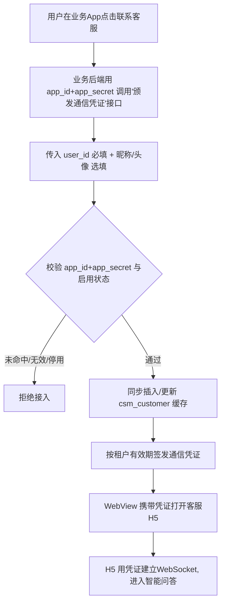
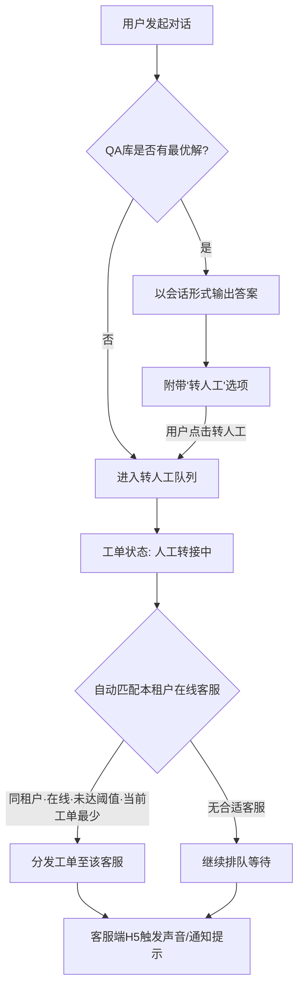
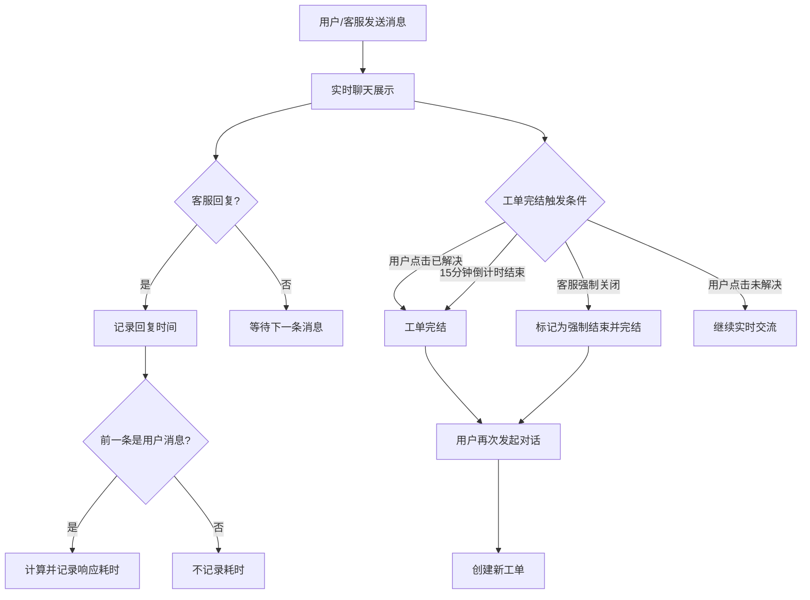
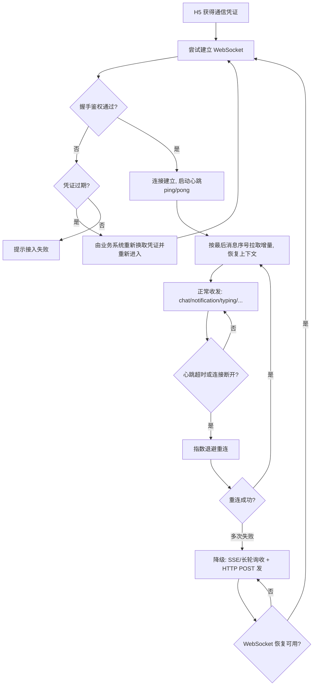

# 独立客服工单系统功能设计文档（V2 · H5 + 业务系统对接版）

> 本版相对上一版的核心变化：用户端、客服端由原生 App 调整为 **H5 实现**；新增 **多业务系统（多租户）对接层**。对接方式由「客服系统出站调用业务系统接口」改为 **业务系统主动调用客服系统的「颁发通信凭证」接口**：业务系统用注册时分配的 `app_id + app_secret` 加上自身 `user_id`（必填）、昵称/头像（选填）换取通信凭证，客服系统在该接口内同步缓存 C 端用户信息。客服系统不再自建 C 端用户账号体系。

---

## 一、 背景与目标

### 1.1 项目背景
随着业务的不断发展，现有客户服务体系需要进一步升级。为提升用户满意度、规范客服处理流程，并实现跨端（H5、PC 后台）高效协同，我们设计一套**独立的客服工单系统**。

该系统以 **H5 方式无缝嵌入各业务系统的 App / 站点**，由业务系统传递已登录用户身份，提供从用户发起提问、智能问答、转接人工到工单完结的全链路服务闭环；同时作为**独立的、可被多个业务系统对接**的客服中台。

### 1.2 项目目标
* **用户端赋能**：以 H5 形式内嵌于业务 App，免独立注册登录，提供便捷提问渠道，支持智能问答与人工实时交流，实现工单生命周期自主管理。
* **客服端提效**：以 H5 形式（独立账号登录）实现随时随地接单，提供自动派单、消息提醒、响应耗时统计等功能。
* **管理端精细化运营**：PC 后台采用 **SaaS 多租户自助模式**——平台超级管理员跨租户运营，各租户管理员仅管理本租户的账号权限、工单追踪、多维统计、QA 知识库与客服接入阈值等。
* **开放可对接**：以标准接口对接多个业务系统，业务系统只需用 `app_id + app_secret` 调用客服系统的「颁发通信凭证」接口（传入自身 `user_id` 与可选昵称/头像）即可接入。
* **数据租户级隔离**：配置、C 端用户、客服人员、QA 库、工单、会话与统计等**全部业务数据按租户（`app_id`）隔离**，租户之间互不可见（详见 2.6）。

### 1.3 本次重构变更说明
| 维度 | 上一版 | 本版（V2） |
| --- | --- | --- |
| 用户端形态 | 原生 App | **内嵌 H5（WebView）** |
| 客服端形态 | 原生 App | **H5（独立账号登录）** |
| C 端用户身份 | 系统内自建/管理 | **由业务系统传入 user_id**，系统侧以 `app_id + user_id` 唯一标识 |
| 用户信息来源 | 系统内维护 | **业务系统换取凭证时传入昵称/头像**并缓存；客服侧展示用缓存 |
| 业务系统对接 | 单一/隐式 | **多租户**，PC 后台注册接入并按租户隔离；业务系统主动调用「颁发通信凭证」接口接入 |
| 数据隔离 | 单一/隐式 | **全量业务数据按租户（`app_id`）隔离**，行级权限控制（详见 2.6） |
| 管理后台 | 单一运营 | **SaaS 多租户**：平台超管跨租户 + 租户管理员仅限本租户 |
| 实时通信 | App 推送 | **单条 WebSocket（逻辑通道区分通知/聊天）** + 页面内声音/通知提醒，不可用时降级 SSE/长轮询 |

---

## 二、 系统架构与对接设计（核心新增）

### 2.1 整体架构
```text
业务系统A App ─┐
业务系统B App ─┤  内嵌WebView(用户端H5)
业务系统C 站点 ─┘            │
                            ▼
            ┌──────────────────────────────┐
            │        客服工单系统            │
            │  用户端H5  客服端H5  PC后台    │
            │      └─── 后端服务 ───┘        │
            │   WebSocket网关 / 工单引擎 /    │
            │   派单引擎 / QA库 / 统计        │
            │        对接适配层(多租户)        │
            └───────────────▲───────────────┘
                            │ 入站调用(app_id+app_secret 鉴权)
                            │
          业务系统后端 ── 调用「颁发通信凭证」接口换取凭证
```

### 2.2 多租户与业务系统接入
* 每个业务系统在 PC 后台由**平台超级管理员**注册为一个**租户**，分配 `app_id` 与 `app_secret`，并配置凭证有效期等参数；同时为该租户开通至少一个**租户管理员账号**。
* 客服系统内 **C 端用户唯一标识 = `app_id` + `user_id`**（不同业务系统的 user_id 互不冲突）。
* 系统内统一以 **`app_id`**（业务系统/租户标识）作为所有业务数据（配置、用户、客服、QA、工单、会话、统计）的隔离键（详见 2.6）。
* 业务系统通过 `app_id + app_secret` 调用客服系统的「颁发通信凭证」接口接入，凭证按租户配置的有效期签发。

**租户接入配置项**：`app_id`、`app_secret`、凭证有效期（分钟）、IP 白名单（可选）、启用状态。

### 2.3 用户身份获取流程（业务后端换取凭证 + WebView 携带）
1. 用户在业务 App 内点击「联系客服」。
2. 业务 App 通知**自身后端**：业务后端用 `app_id + app_secret` 调用客服系统的**「颁发通信凭证」接口**，传入当前登录用户的 `user_id`（必填）与昵称、头像（选填）。
3. 客服后端校验 `app_id + app_secret` 与租户启用状态，**同步插入/更新 `csm_customer` 缓存**（昵称、头像），并按租户配置的有效期签发**通信凭证（session token）**返回给业务后端。
4. 业务 App 用 WebView 打开客服 H5，URL 携带凭证，例如：
   `https://kf.example.com/h5?app_id=biz_a&credential=xxxxx`
5. 客服 H5 直接使用该凭证建立 WebSocket、收发消息；**每次进入客服系统都由业务系统重新换取凭证**。

> 该方案下 `app_secret` 只在业务系统后端与客服后端之间使用，不下发到 H5；凭证有效期短、随进随取，安全性优于 URL 直接携带 user_id。

### 2.4 客服系统提供的对接接口（业务系统调用）
| 接口 | 入参 | 出参 | 用途 |
| --- | --- | --- | --- |
| 颁发通信凭证 | `app_id`、`app_secret`、`user_id`（必填）、`nickname`（选填）、`avatar`（选填） | 通信凭证（session token）、有效期 | 业务系统每次进入客服系统时换取凭证；同步缓存 C 端用户展示信息 |

> 接口在同一次调用内完成「鉴权 → 缓存用户信息（插入/更新）→ 签发凭证」，业务系统无需再单独提供身份换取或用户信息查询接口。

### 2.5 用户信息处理策略（换取凭证时同步缓存）
* **同步缓存**：业务系统每次换取凭证时传入的昵称、头像等**展示用基础信息**会写入/更新 `csm_customer`，用于会话列表/聊天界面与客服侧快速展示。
* **缓存即展示源**：客服侧「用户详情」直接读取该缓存；业务系统为用户信息的唯一权威来源，如需更新，业务系统在下次换取凭证时传入最新昵称/头像即可。

### 2.6 数据隔离与权限模型（核心新增）

系统以 **`app_id` 为唯一隔离键**，实现全量业务数据的租户级隔离；任意数据访问都强制绑定租户上下文，杜绝跨租户读写。

**① 隔离维度（全部按租户隔离）**

| 数据域 | 隔离说明 |
| --- | --- |
| 配置 | 客服接入阈值、提醒策略、自动完结时长等均按租户独立配置，互不影响 |
| C 端用户 | 以 `app_id + user_id` 联合标识，天然按租户隔离；仅本租户可检索本租户用户 |
| 客服人员 | 每个客服账号**仅归属一个租户**，只接本租户工单（详见 4.2、5.4） |
| QA 库 | 每个租户独立维护问答对与关键词，**完全隔离**、互不可见 |
| 工单 / 会话 / 消息 | 创建时即写入 `app_id`，查询、派单、统计全程按租户过滤 |
| 统计分析 | 各项指标按租户独立汇总；仅平台超管可做跨租户对比 |

**② 隔离机制**
* **数据层**：所有业务表均含 `app_id` 列；数据访问层统一注入租户上下文，对查询/写入强制追加 `app_id` 条件（行级隔离），应用层不得绕过。
* **接口层**：登录态携带 `app_id`（平台超管为「当前选中租户」）；服务端对每个请求校验目标资源 `app_id` 与会话 `app_id` 一致，越权直接拒绝。
* **实时层**：WebSocket 连接绑定 `app_id`，消息收发按 `app_id + user_id`（C 端）/ 客服账号 双重校验，防止跨租户串话（详见 4.5）。

**③ 角色与可见范围（SaaS 多租户）**

| 角色 | 归属 | 可见 / 可管理范围 |
| --- | --- | --- |
| 平台超级管理员 | 平台 | 跨租户：租户注册与接入配置、全局菜单/角色、跨租户运营与统计 |
| 租户管理员 | 单一租户 | **仅本租户**：本租户客服账号、QA 库、接入阈值与各项配置、工单、统计、C 端用户查看 |
| 客服人员 | 单一租户 | **仅本租户**：被分发到的本租户工单与会话 |

> 设计要点：除平台超管外，任何账号的所有操作都被**强制限定在其 `app_id` 范围内**；租户 A 的管理员、客服无法看到租户 B 的任何配置、用户、客服、QA 与工单数据。

---

## 三、 功能思维导图（Tree 格式）

```text
独立客服工单系统
├── 用户端 H5（内嵌于业务App WebView）
│   ├── 身份接入
│   │   ├── 业务后端用 app_id+app_secret 换取通信凭证
│   │   ├── WebView携带凭证打开H5（免独立登录）
│   │   └── 凭证建立会话与WebSocket
│   ├── 智能问答
│   │   ├── QA库优先匹配
│   │   ├── 最优解会话输出
│   │   └── 附带转人工选项
│   ├── 实时聊天
│   │   ├── 文本与多媒体收发
│   │   ├── 已读回执与正在输入
│   │   └── 未命中直接进队列
│   ├── 工单生命周期
│   │   ├── 首次对话创建工单
│   │   ├── 会话绑定当前工单
│   │   └── 完结后新建工单
│   └── 服务评价与完结
│       ├── 用户点击已解决
│       ├── 15分钟倒计时自动完结
│       └── 点击未解决继续交流
├── 客服端 H5（独立账号登录）
│   ├── 登录与状态管理
│   │   ├── 独立账号登录（PC后台统一管理）
│   │   ├── 手动上线接单
│   │   └── 下线
│   ├── 消息通知
│   │   ├── 新工单声音/页面提示
│   │   ├── 新消息声音/页面提示
│   │   └── 浏览器通知与标题闪烁（页面在线）
│   ├── 会话展示
│   │   ├── 用户/工单/会话层级
│   │   ├── 用户信息（缓存展示昵称/头像）
│   │   ├── 未读数与已读状态
│   │   └── 实时聊天加载（WebSocket）
│   ├── 工单处理
│   │   ├── 实时回复
│   │   ├── 转接其他客服
│   │   └── 强制关闭工单
│   └── 数据记录
│       ├── 回复时间记录
│       └── 响应耗时计算
└── PC管理后台（SaaS 多租户·分级权限）
    ├── 平台超级管理员（跨租户）
    │   ├── 业务系统接入（多租户）
    │   │   ├── 租户注册 / app_id·app_secret 分配
    │   │   ├── 凭证有效期等参数配置
    │   │   └── 接入启用/停用
    │   ├── 租户管理员账号开通
    │   ├── 全局菜单与角色权限模板
    │   ├── 跨租户运营与统计
    │   └── 操作审计日志（跨租户）
    └── 租户管理员（仅本租户·按 app_id 隔离）
        ├── 系统管理
        │   ├── 菜单管理
        │   └── 角色权限管理
        ├── 账号管理（本租户）
        │   ├── PC端账号管理
        │   └── 客服端H5账号管理（单租户归属·独立账号体系）
        ├── C端用户查看（只读·本租户）
        │   ├── 按 app_id + user_id 检索
        │   └── 展示缓存信息（昵称/头像）
        ├── 工单列表（本租户）
        │   ├── 会话组列表
        │   ├── 聊天详情查看
        │   └── 强制结束状态标记
        ├── 统计分析（本租户）
        │   ├── 工单统计
        │   └── 客服工作情况统计
        ├── QA库管理（本租户独立·完全隔离）
        │   ├── 问答对创建
        │   └── 关键词关联配置
        ├── 客服接入配置（本租户）
        │   ├── 单人最大接入阈值
        │   └── 阈值为0表示不限制数量
        └── 操作审计日志（本租户）
```

---

## 四、 功能设计

### 4.1 用户端（H5）
1. **身份接入**：H5 内嵌于业务 App 的 WebView，进入前由业务后端用 `app_id + app_secret` 换取通信凭证（携带 `user_id` 及可选昵称/头像），WebView 携带凭证打开 H5，用户**无需在客服系统单独注册登录**（详见 2.3）。
2. **智能问答与转人工**：用户发起对话时，系统优先在 QA 库检索最优解。命中则以会话形式输出答案并附带「转人工」选项；未命中则直接进入转人工队列，工单状态变更为「人工转接中」。
3. **工单生命周期**：
   * 用户首次发起对话即创建新工单，后续对话均绑定该工单。
   * 完结条件：用户点击「已解决」、15 分钟倒计时结束、或客服强制关闭。
   * 点击「未解决」可继续交流；工单完结后再次发起对话则创建新工单。
4. **实时交流**：基于 WebSocket，支持文本、图片等多媒体消息实时收发；显示对端「正在输入」与消息「已读」状态（详见 4.5 已读回执）。

### 4.2 客服端（H5）
1. **登录与上下线**：客服使用**独立账号密码登录**（账号由所属租户的管理员在 PC 后台创建，**单租户归属**，与业务系统用户体系隔离）；登录后手动点击「上线」进入接单模式，**仅接收本租户工单**。
2. **消息提醒**：有新工单分发或用户发送新消息时，触发**页面内声音提示**；并辅以**浏览器通知（Notification API）+ 标签页标题闪烁**。
   > H5 限制：页面关闭后无法接收推送。客服需保持 H5 页面在线接单；可选通过外部渠道（如企业 IM）做补充提醒。首次声音播放需一次用户交互以解锁浏览器音频自动播放策略。
3. **会话展示**：层级显示「用户 → 工单 → 会话消息」，消息以实时聊天形式（WebSocket）加载；会话列表展示**未读消息数**、聊天界面展示消息**已读状态**（详见 4.5 已读回执）；用户信息展示业务系统换取凭证时同步的缓存基础信息（昵称/头像，详见 2.5）。
4. **回复耗时记录**：客服每次回复时系统自动记录回复时间；若前一条为用户消息，则自动计算并记录两者时差（响应耗时）。
5. **工单操作**：支持实时回复、转接其他客服、强行关闭工单（系统记录「强制结束」状态）。

### 4.3 PC 管理后台（SaaS 多租户·分级权限）

后台按角色分级，除平台超管外所有操作强制限定在自身 `app_id` 范围内（详见 2.6）。

#### 4.3.1 平台超级管理员（跨租户）
1. **业务系统接入（多租户）**：注册业务系统、分配 `app_id/app_secret`、配置凭证有效期等参数、启用/停用接入（详见 2.2）。
2. **租户开通**：为每个租户开通并管理其租户管理员账号。
3. **全局系统管理**：全局菜单、角色权限模板。
4. **跨租户运营**：跨租户的工单与客服统计对比、平台级监控。
5. **操作审计日志（跨租户）**：查看各租户与平台级的关键操作留痕（登录、租户启停、接入配置变更、账号增删等），支持按租户、操作人、模块、时间检索，用于安全审计与合规追溯。

#### 4.3.2 租户管理员（仅本租户，数据按 `app_id` 隔离）
1. **系统与账号管理**：本租户的菜单、角色权限配置；管理本租户可登录 PC 后台与客服端 H5 的**内部账号**（客服账号单租户归属）。
2. **C 端用户查看（只读）**：按 `app_id + user_id` 检索**本租户**用户，展示业务系统换取凭证时同步的缓存信息（昵称/头像）；C 端用户不在客服系统内创建/编辑。
3. **工单列表**：展示**本租户**所有用户发起的会话组，支持查看详情及聊天记录。
4. **统计分析**（均限本租户）：
   * **工单统计**：工单总量、完结率、平均处理时长等。
   * **客服工作情况统计**：在线时长、接待量、平均响应耗时、强制关闭次数等；由定时任务**按日预聚合**，报表支持按日期范围与客服维度查询。
5. **QA 库管理**：创建、编辑**本租户独立**的问答对及关联关键词（与其他租户完全隔离）。
6. **客服接入配置**：配置本租户单个客服最大同时接入量（阈值），**阈值为 0 表示不限制其接入数量**。
7. **操作审计日志（本租户）**：记录并查询本租户内后台与客服端的关键操作（账号增删、QA 编辑、工单强制关闭/转接、配置变更等），仅本租户可见。

### 4.4 H5 技术要点（端形态变更带来的关键约束）
* **实时通信**：统一采用 WebSocket（断线自动重连、心跳保活）；不可用时按 4.5 降级策略处理。
* **消息提醒**：页面在线时声音 + 浏览器通知 + 标题闪烁；离线推送非 H5 能力，需保持页面在线或借助外部渠道。
* **会话连续性**：H5 刷新/重连后凭通信凭证恢复当前工单与消息上下文；凭证过期需由业务系统重新换取并重新进入。
* **多媒体**：图片等通过对象存储上传后传递引用，适配移动端 WebView 上传体验。

### 4.5 实时通信方案设计（WebSocket 单连接 + 逻辑通道）

**技术选型结论：统一采用单条 WebSocket 长连接，不采用 WebSocket + SSE 的双连接组合。**

客服聊天是强双向交互（用户发、客服发、输入中、已读、转接、状态变更），SSE 仅支持服务端单向推送，发送侧仍需另走 HTTP，链路割裂；双长连接还会带来移动端 WebView 耗电、HTTP/1.1 域名连接数上限、两通道消息乱序/状态不一致等问题。因此通知与聊天**共用同一条 WebSocket 物理连接，通过消息 `type` 字段划分逻辑通道**，既隔离业务又复用连接、保证消息同源同序。

* **逻辑通道划分**：同一条连接上以消息 `type` 区分业务，典型类型如下：

  | type | 方向 | 用途 |
  | --- | --- | --- |
  | `chat` | 双向 | 文本/多媒体聊天消息收发 |
  | `typing` | 双向 | 对端「正在输入」状态 |
  | `read` | 双向 | 消息已读回执 |
  | `notification` | 下行 | 新工单分发、新消息提醒（触发声音/浏览器通知/标题闪烁） |
  | `ticket_status` | 下行 | 工单状态变更（人工转接中/处理中/已完结/强制结束/转接） |
  | `ping` / `pong` | 双向 | 心跳保活 |
  | `ack` | 双向 | 消息送达确认（配合客户端去重与重发） |

* **连接生命周期**：H5 拿到会话凭证后建立连接；客户端定时发送 `ping`，服务端 `pong` 回应，超时未收到则判定断线。
* **断线重连**：指数退避重连（如 1s、2s、4s…上限封顶），重连成功后凭会话凭证恢复上下文，并按本地最后消息序号向服务端拉取断连期间的增量消息，避免丢消息。
* **消息可靠性**：每条消息带客户端生成的唯一 `msg_id` 与递增序号；服务端落库后回 `ack`；客户端按 `msg_id` 去重、对未 `ack` 消息超时重发，保证「不丢、不重、有序」。
* **已读回执**：客户端读取消息后经 `read` 通道上报已读到的最大序号；服务端按「工单 + 阅读方」记录已读水位（`last_read_seq`）并下发对端，用于渲染「已读」标记与计算未读数；采用高水位单行更新，不逐条记录（落库见 `csm_ticket_message_read`）。
* **历史消息加载**：实时聊天历史**按 `app_id + user_id` 跨工单加载**（同一 C 端用户的完整对话记录），按消息主键 `id`（即时间）倒序分页，前端不传工单号；消息表 `csm_ticket_message` 冗余 `user_id` 字段以免与工单表联查。已读水位与未读数仍按工单维度（`seq`）维护。
* **降级策略**：WebSocket 不可用（代理拦截、网络限制等）时，自动降级为 **SSE / 长轮询接收下行 + HTTP POST 发送上行** 的组合；此为兜底通道，恢复后自动切回 WebSocket。
* **鉴权与安全**：连接握手时校验通信凭证（session token），凭证按租户配置的有效期签发；过期后由业务系统重新换取凭证并重新进入（详见 2.3）；服务端按 `app_id + user_id` / 客服账号校验消息收发权限，防止越权。

---

## 五、 核心业务流程图（Mermaid）

### 5.1 用户进入与身份鉴权流程（新增）


### 5.2 用户发起对话与智能分流流程


### 5.3 实时交流与工单完结流程


### 5.4 智能派单逻辑说明
当工单进入人工队列时，系统自动匹配满足以下**全部条件**的客服人员：
1. **归属于该工单所属租户（`app_id` 一致）**——派单严格限定在本租户客服范围内。
2. 处于「上线」状态。
3. 当前处理中工单数量未达到配置的最大接入阈值（**阈值为 0 则跳过此项限制，视为不限制数量**）。
4. 在所有满足条件的客服中，当前处理中工单数量最少。

### 5.5 实时连接建立与降级流程（新增）


---

## 六、 关键实体与标识约定

| 实体 | 关键标识 / 字段 | 说明 |
| --- | --- | --- |
| 业务系统（租户） | `app_id`、`app_secret`、凭证有效期 | PC 后台注册，**作为全量数据隔离键**（详见 2.6） |
| C 端用户 | **`app_id` + `user_id`**（联合唯一） | 身份来自业务系统，昵称/头像随换取凭证同步缓存；天然按租户隔离 |
| 客服/后台账号 | 内部账号 ID、**`app_id`**、角色 | 独立账号体系；客服**单租户归属**；角色含平台超管/租户管理员/客服 |
| QA 问答对 | QA ID、**`app_id`**、问题/答案、关键词 | 各租户独立维护，**完全隔离** |
| 租户配置 | **`app_id`**、接入阈值、提醒/完结策略等 | 按租户独立配置 |
| 工单 | 工单 ID、**`app_id`**、所属用户、状态、完结方式 | 状态含：智能问答 / 人工转接中 / 处理中 / 已完结（含强制结束） |
| 会话消息 | 消息 ID、**`app_id`**、工单 ID、**所属 user_id**、发送方、时间、类型 | 文本/图片等；冗余 user_id 支撑按人查历史；用于耗时计算与记录 |
| 实时消息（传输层） | `msg_id`（客户端唯一）、序号、`type`、`ack` | 用于 WebSocket 去重、有序、断线增量恢复（详见 4.5） |
| 响应耗时 | 客服回复时间 − 上一条用户消息时间 | 仅当前一条为用户消息时记录 |
| 消息已读水位 | **`app_id`**、工单 ID、阅读方、`last_read_seq` | 高水位记录已读位置，支撑 `read` 回执与未读数（详见 4.5） |
| 操作日志 | **`app_id`**、操作人、模块、动作、目标、时间 | 后台/客服端关键操作审计留痕 |
| 客服工作日汇总 | **`app_id`**、客服、日期、在线时长/接待量/响应耗时/强制关闭 | 统计按日预聚合，加速报表查询 |

> 说明：① 客服系统不存储 C 端用户的权威资料，仅按 `app_id + user_id` 缓存换取凭证时传入的展示信息（昵称/头像），用户详情以业务系统为准；② **除平台超管外，所有实体的读写都强制限定在自身 `app_id` 范围内**，租户间数据互不可见（详见 2.6）。
