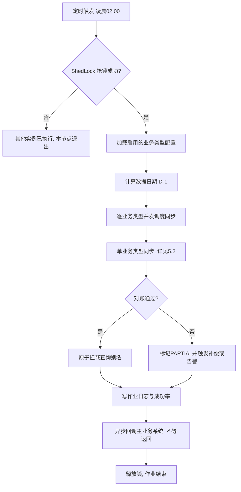
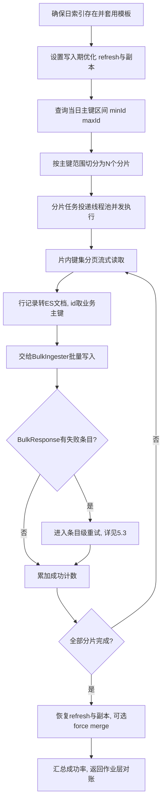
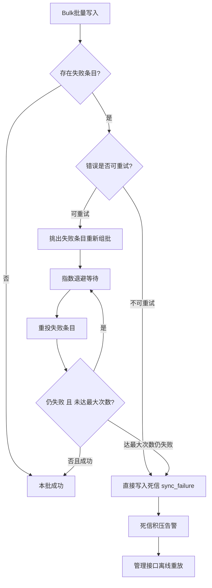
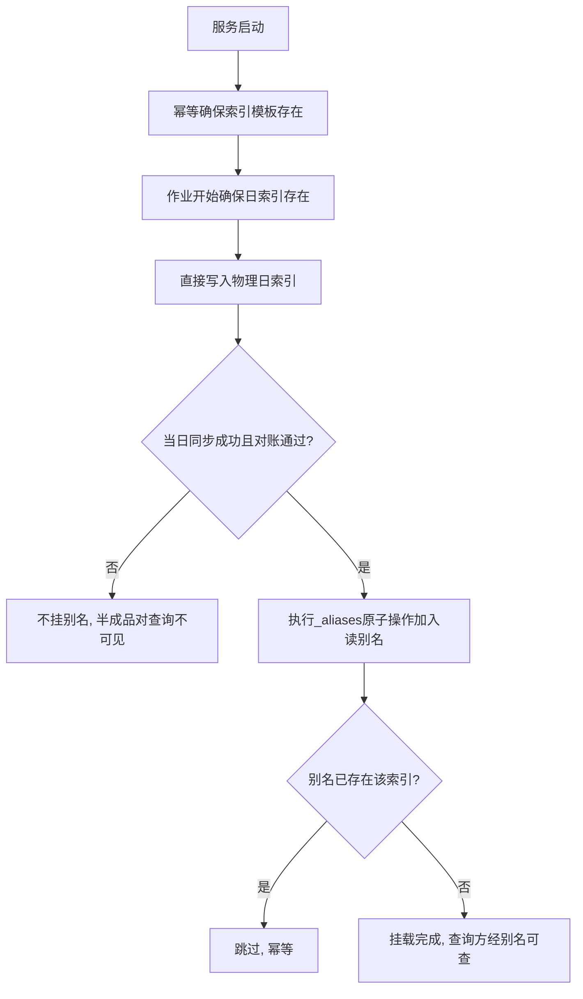
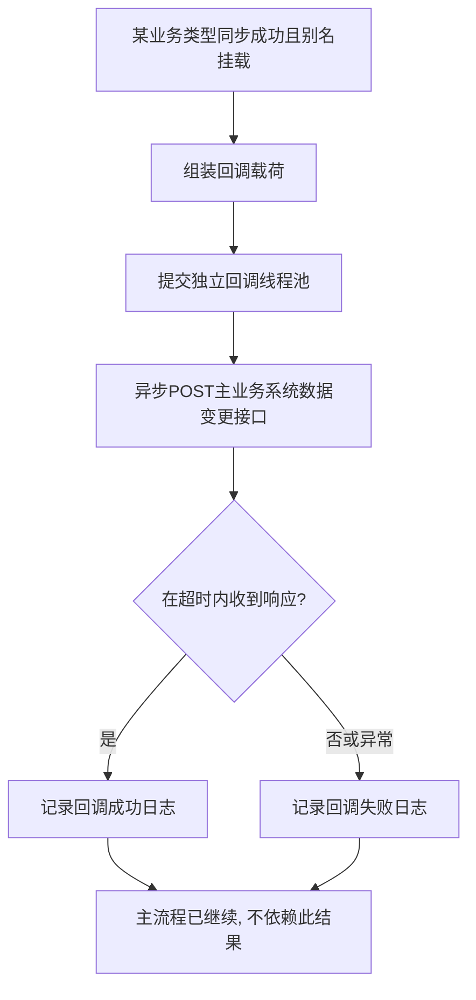
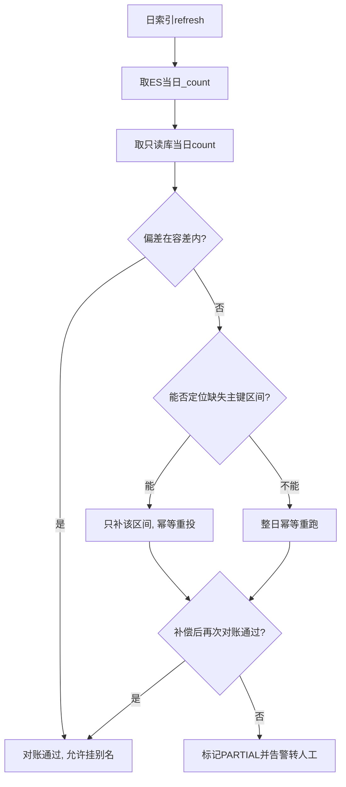

# 直播平台数据中台（数据仓储）设计文档（V1 · ES8 + T+1 同步版）

> 本文档面向直播平台「金币记录」「钻石记录」等**每日百万至千万级增量**的流水类数据，设计一套以 **Elasticsearch 8.19** 为存储底座的**独立数据中台（数据仓储）服务**。核心能力：将 MySQL 中的记录以 **T+1** 方式按天同步至 ES，按 `业务类型-年月日` 滚动建索引并挂统一查询别名；同步完成后**异步回调主业务系统的「数据变更接口」（不等待返回值）**；具备**并发同步线程池**、**多级失败重试（关键）**、**每次定时任务的作业日志与成功率统计**。
>
> 设计目标是把高频流水从主库/在线库卸载到 ES，缓解主业务系统的存储与查询压力，同时提供面向运营/对账/检索的统一查询入口。

---

## 一、 背景与目标

### 1.1 项目背景
直播平台的金币、钻石等虚拟资产流水属于典型的**高频写入、海量累积、强查询/聚合**数据：每日新增量已达**百万至千万级**，并持续增长。这类数据长期堆积在业务 MySQL 中会带来三个突出问题：

* **存储与索引膨胀**：单表/分表持续增长，B+ 树索引维护成本高，备份与 DDL 风险增大。
* **查询能力受限**：运营后台的多维检索、时间范围聚合、对账统计在 MySQL 上代价高、易拖慢在线业务。
* **冷热混杂**：历史流水（冷数据）与当日在线写入（热数据）共用同一套库，互相干扰。

因此需要建设一个**独立运行的数据中台**，把历史流水以 T+1 批量方式沉淀到更擅长检索与聚合的 Elasticsearch，主业务系统只保留近线数据，历史查询统一走中台。

### 1.2 项目目标
* **卸载与沉淀**：将 MySQL 中的流水记录按天 **T+1** 全量沉淀到 ES，支撑主库瘦身（主库可据此做归档/清理，由主业务系统决策）。
* **统一检索底座**：以 `业务类型-年月日` 滚动索引 + **统一别名**对外提供检索/聚合能力，查询方无需感知物理分日索引。
* **独立、可靠、可观测**：服务独立部署、独立调度；同步具备**并发能力**、**多级重试**、**幂等可重跑**、**作业日志与成功率**全程可观测。
* **解耦回调**：同步完成后**异步、不阻塞地**通知主业务系统（fire-and-forget），由主业务系统据此推进后续动作（如归档标记、缓存失效等）。
* **可扩展多业务类型**：金币、钻石之外，后续新增业务类型（如礼物、充值流水）应**以配置接入为主，尽量零代码**。

### 1.3 范围与非目标（Scope / Non-Goals）
| 维度 | 本期范围（In Scope） | 非目标（Out of Scope） |
| --- | --- | --- |
| 同步方向 | MySQL → ES，**单向、批量、T+1** | 实时 CDC（binlog 流式同步）、双向同步 |
| 数据时效 | 次日同步前一天全量分区 | 当日实时可查（热数据仍在主业务系统） |
| 数据范围 | 金币记录、钻石记录（可配置扩展） | 非流水类主数据、维度表治理 |
| 查询能力 | 提供索引/别名与 Mapping 规范，供查询方接入 | 面向 C 端的查询 API 产品化（另立项） |
| 数据清理 | 中台侧索引保留策略（ILM） | 主业务系统 MySQL 的归档/删除（由主业务系统执行，中台仅回调通知） |

> 说明：选择 **T+1 批量**而非实时 CDC，是因为本场景诉求是「历史流水沉淀 + 离线检索/对账」，对实时性不敏感；批量同步实现简单、对主库冲击可控、重跑与对账成本低。若后续出现准实时诉求，可在本架构上叠加 CDC 通道，互不冲突。

### 1.4 技术选型与版本基线
| 组件 | 选型 / 版本 | 说明 |
| --- | --- | --- |
| 运行时 | **JDK 21** | 使用虚拟线程（可选）、记录类、模式匹配等特性 |
| 框架 | **Spring Boot 3.5.14** | 基线框架；自带 ES 客户端自动装配 |
| 搜索/存储 | **Elasticsearch 8.19.x**（建议取最新补丁，如 8.19.16） | 8.x 线最成熟稳定版本；本期存储底座 |
| ES 客户端 | **`co.elastic.clients:elasticsearch-java` 8.19.x** | 官方 Java API Client（替代已废弃的 High Level REST Client） |
| Spring 集成 | **Spring Data Elasticsearch 5.5.x**（Spring Boot 3.5 默认托管） | 查询侧便利封装；装载侧直接用原生客户端 + `BulkIngester` |
| 数据源 | **MySQL 8.x（读从库/只读实例优先）** | 抽取走只读实例，避免冲击主库 |
| 持久层 | MyBatis / Spring JDBC（二选一，建议 MyBatis + 流式游标） | 大结果集流式读取 |
| 分布式锁 | **ShedLock 7.7.0**（`net.javacrumbs.shedlock:shedlock-spring` + `shedlock-provider-jdbc-template`） | 多实例部署时保证定时任务**仅单节点执行** |
| 重试 | Spring Retry + Resilience4j（回调侧） | ES 批次/条目级重试见 §4.5 |
| 可观测 | Micrometer + Prometheus + Grafana（可选） | 指标与告警 |
| 构建 | Maven（或 Gradle） | 见 §7.4 依赖清单 |

> **版本对齐提示**：Spring Boot 3.5 默认托管的 `elasticsearch-java` 客户端小版本可能为 8.18.x。8.x 内跨小版本通过 REST 协议总体兼容，但**建议显式将客户端对齐到服务端 8.19.x**（Maven 中覆盖属性 `<elasticsearch-client.version>8.19.x</elasticsearch-client.version>`），以规避边界 API 差异。

---

## 二、 系统架构设计

### 2.1 整体架构
```text
        主业务系统 MySQL（金币/钻石流水, 按天增量）
                 │  ① T+1 抽取（只读从库, 游标分页）
                 ▼
   ┌─────────────────────────────────────────────────────────┐
   │                数据中台 datahub（独立服务）                  │
   │                                                           │
   │   调度层  Scheduler + ShedLock（单节点执行, cron 02:00）    │
   │   抽取层  MySQL Reader（游标/键集分页, 分片切分）            │
   │   转换层  Mapper：行记录 → ES Doc（_id = 业务主键, 幂等）    │
   │   装载层  BulkIngester + 线程池（并发分片, 背压）           │
   │   重试层  条目级 / 分片级 / 作业级 多级重试 + 死信          │
   │   索引层  模板 + 分日建索引 + 别名原子切换 + ILM 保留        │
   │   对账层  MySQL Count ↔ ES Count 校验与补偿                │
   │   日志层  sync_job_log 作业日志 & 成功率                    │
   │   回调层  异步通知（fire-and-forget, 不等返回）            │
   └───────────────┬───────────────────────────┬─────────────┘
            ② 写入 │                   ④ 同步完成回调（不等返回）
                   ▼                             ▼
        Elasticsearch 8.19                主业务系统「数据变更接口」
   coin-record-2026.06.18（物理日索引）        POST /xxx/data-changed
   diamond-record-2026.06.18                  （归档标记 / 缓存失效等）
        ▲ ③ 别名
   coin-record（读别名, 查询方使用）
   diamond-record（读别名）
```

### 2.2 分层职责
| 层 | 职责 | 关键点 |
| --- | --- | --- |
| 调度层 | 触发每日 T+1 作业；多实例下保证单节点执行；支持手动触发/重跑 | ShedLock 分布式锁；cron 可配 |
| 抽取层 | 从只读库按「业务日期分区」流式读取记录；按主键范围切分分片 | 游标/键集分页，杜绝深分页 OFFSET |
| 转换层 | 行记录 → ES 文档；统一 `_id` 取值（业务主键）实现幂等 | DTO/Mapper 配置驱动 |
| 装载层 | 通过 `BulkIngester` 批量写 ES；线程池并发多分片/多业务 | 批大小、并发度、背压可配 |
| 重试层 | 条目级（仅重投失败条目）、分片级、作业级三级重试；死信兜底 | 区分可重试/不可重试错误 |
| 索引层 | 按命名规范分日建索引；模板统一 Mapping/Setting；完成后原子挂别名 | 写后挂别名，避免半成品被查 |
| 对账层 | 同步后校验 MySQL 与 ES 计数；偏差超阈值触发补偿/告警 | 数据质量闸门 |
| 日志层 | 记录每次作业的入参、计数、成功率、耗时、状态、错误摘要 | `sync_job_log`，可查询可告警 |
| 回调层 | 同步成功后异步通知主业务系统，不阻塞、不等待返回 | 独立线程池，超时即放弃，仅记录 |

### 2.3 关键设计原则
1. **幂等可重跑（最重要）**：ES 文档 `_id` 固定取**源表业务主键**（或业务唯一键）。重跑/重试时使用 `index`（upsert）语义覆盖写入，**绝不产生重复**。任何一天的数据都可安全地无限次重跑。
2. **可重入与原子可见**：同步过程直接写物理日索引；**只有整批同步成功后**才把该日索引挂入查询别名，查询方永远看不到半成品数据。
3. **并发可控、对源可控**：并发度、批大小、读取并发均可配置并设上限，保护 MySQL 只读实例与 ES 集群；抽取一律走**从库/只读实例**。
4. **配置驱动多业务类型**：金币、钻石、后续新增类型均以 `SyncTaskDefinition` 配置接入（源表、主键、时间字段、目标索引前缀、Mapping、别名），尽量零编码。
5. **全程可观测**：每次作业、每个分片、每个批次的结果都可追溯；成功率、耗时、失败明细均落库与上报。
6. **失败不丢**：超过最大重试仍失败的条目进入**死信存储**，支持离线补偿重放，永不静默丢数据。

### 2.4 索引与别名设计
* **物理日索引命名**：`{业务类型}-{yyyy.MM.dd}`，例如 `coin-record-2026.06.18`、`diamond-record-2026.06.18`。
  * 其中 `yyyy.MM.dd` 为**数据业务日期（即被同步数据所属的那一天，D-1）**，而非作业运行日期。详见 §2.5 的 T+1 边界约定。
* **查询别名**：`{业务类型}`，例如 `coin-record`、`diamond-record`。别名指向该业务类型下的（全部或近 N 天）日索引，**查询方只用别名，不感知分日物理索引**。
* **索引模板**：通过 component template + index template，使**新建的每个日索引自动套用统一 Mapping 与 Settings**（分片数、副本数、refresh_interval 等），避免逐日手工建模。
* **写入与可见性**：同步阶段直接写日索引并临时关闭/调大 `refresh_interval` 以提升吞吐；**完成后**再 `_aliases` 原子操作把日索引加入查询别名（写后挂别名）。
* **保留策略（ILM）**：对历史日索引配置 Index Lifecycle Management，按业务保留期（如 180 天）自动进入 delete 阶段；中台仅管理自身索引保留，**不**代替主业务系统做 MySQL 清理。

### 2.5 数据流与一致性（T+1 边界约定）
* **T+1 定义**：在运行日 D（如每日 02:00）同步**前一天 D-1 全天**的数据，写入名为 `{业务类型}-{D-1 的 yyyy.MM.dd}` 的索引。
  * 例：2026-06-19 凌晨运行的作业，同步 2026-06-18 全天数据，写入 `coin-record-2026.06.18`。
* **分区边界**：以源表的**业务时间字段**（如 `create_time`）落在 `[D-1 00:00:00, D-1 23:59:59.999]` 为同步范围；强烈建议源表对该字段有索引或本身按天分区，以支撑高效范围扫描。
* **一致性级别**：本期为**最终一致 + 对账保障**。同步后通过 §4.9 的计数对账确保「源表当日行数 ≈ ES 当日文档数」，偏差超阈值则补偿或告警；配合幂等重跑，最终达到一致。

---

## 三、 功能思维导图（Tree 格式）

```text
数据中台 datahub（独立服务）
├── 调度与触发
│   ├── 每日定时（cron 02:00, 可配）
│   ├── 分布式锁（ShedLock, 多实例单节点执行）
│   ├── 手动触发 / 指定日期重跑（运维接口）
│   └── 失败日自动补跑（延时重试）
├── 数据抽取（MySQL → 内存批）
│   ├── 只读从库 / 只读实例
│   ├── 业务日期分区（D-1 全天）
│   ├── 键集/游标分页（杜绝深分页）
│   └── 主键范围分片（支撑并发）
├── 数据转换
│   ├── 行记录 → ES Doc（DTO/Mapper）
│   ├── _id = 业务主键（幂等核心）
│   └── 字段映射配置化（多业务类型）
├── 数据装载（→ ES）
│   ├── BulkIngester 批量写
│   ├── 线程池并发（分片/业务并行）
│   ├── 批大小 & 并发度 & 背压可配
│   └── 写入期 refresh_interval 优化
├── 失败重试（关键）
│   ├── 条目级：仅重投失败条目 + 指数退避
│   ├── 分片级：整片重试 N 次
│   ├── 作业级：整日重跑（幂等）
│   ├── 错误分类：可重试 vs 不可重试
│   └── 死信存储 + 离线重放
├── 索引生命周期
│   ├── 命名 业务类型-年月日
│   ├── 索引模板（统一 Mapping/Setting）
│   ├── 别名原子切换（写后挂读别名）
│   └── ILM 保留与删除
├── 数据对账
│   ├── MySQL Count ↔ ES Count
│   ├── 偏差阈值判定
│   └── 超阈值补偿 / 告警
├── 同步完成回调
│   ├── 异步 fire-and-forget（不等返回）
│   ├── 独立线程池 + 超时
│   └── 调用结果仅记录（best-effort）
├── 作业日志与成功率
│   ├── 每次作业落库（sync_job_log）
│   ├── 计数：总数/成功/失败/重试
│   ├── 成功率 & 耗时 & 状态
│   └── 可查询、可告警
└── 监控与运维
    ├── Micrometer 指标（吞吐/耗时/失败率）
    ├── 告警（未运行/成功率低/对账偏差）
    └── 健康检查 & 配置中心
```

---

## 四、 功能设计

### 4.1 调度与分布式锁
1. **定时触发**：基于 Spring `@Scheduled(cron = "${datahub.sync.cron:0 0 2 * * ?}")` 每日凌晨触发；cron 可配，建议放在业务低峰。
2. **单节点执行**：服务可多实例部署（HA），通过 **ShedLock** 对定时方法加锁（`@SchedulerLock(name="dailySyncJob", lockAtLeastFor, lockAtMostFor)`），保证**同一时刻仅一个实例执行**，避免重复同步。锁信息存于共享 MySQL（`shedlock` 表）。
3. **作业编排**：一次作业内，对所有启用的 `SyncTaskDefinition`（金币、钻石…）**逐业务类型**调度；不同业务类型之间可并行（受全局并发上限约束），单业务类型内部再按分片并发（见 §4.4）。
4. **手动与重跑**：提供运维接口（见 §7.1）支持：指定业务类型 + 指定日期的**手动触发/重跑**（幂等）、失败作业重跑、死信重放。
5. **自动补跑**：当日作业若整体失败或成功率低于阈值，按配置延时（如 2 小时后）自动补跑一次；仍失败则告警转人工。

### 4.2 数据抽取（MySQL Reader）
1. **数据源**：优先连接**只读从库/只读实例**，抽取不影响主库在线写入。
2. **分区读取**：按业务时间字段范围 `[D-1 00:00:00, D-1 23:59:59.999]` 读取；要求源表该字段有索引或表按天分区。
3. **键集分页（Keyset Pagination）**：以主键 `id > lastId ORDER BY id LIMIT pageSize` 的方式翻页，**绝不使用 `LIMIT offset, size` 深分页**（千万级下深分页代价极高）。
4. **流式游标**：使用 MyBatis `Cursor` / JDBC `fetchSize` 流式读取，避免一次性把整日数据加载进内存。
5. **分片切分（支撑并发）**：先取当日 `[minId, maxId]`，按主键范围均匀切成 N 片（N = 并发分片数），每片作为一个独立任务投递线程池；片内再用键集分页流式读取。
   * 若主键非连续/倾斜严重，退化为**按时间桶切分**（如每小时一片）。

### 4.3 数据转换与映射（幂等核心）
1. **行 → 文档**：每条记录映射为一个 ES 文档；字段映射通过 `SyncTaskDefinition` 配置（列名 → ES 字段、类型、是否索引）。
2. **`_id` 取业务主键**：ES 文档 `_id` **固定取源表主键**（或业务唯一键，如 `订单号`）。这是**幂等的根基**——重跑/重试时同 `_id` 覆盖写入，天然去重。
3. **类型规范**：金额/数量类用 `long`（按最小单位如「分/厘」存整数）或 `scaled_float`；时间用 `date`；用户/房间标识用 `keyword`（精确匹配/聚合）；避免对纯流水字段做 `text` 分词。
4. **写入元数据**：每条文档附 `_sync_batch_id`、`_sync_time`，便于排障与按批回溯。

### 4.4 数据装载（BulkIngester + 线程池并发）
1. **批量写入**：使用官方客户端的 `BulkIngester`（`co.elastic.clients.elasticsearch._helpers.bulk.BulkIngester`），自动按**条数/字节/时间**三阈值触发 flush，内置**背压**（限制在途请求数）。
2. **线程池并发**：自定义 `ThreadPoolTaskExecutor`（核心/最大线程、队列、拒绝策略可配），每个分片任务一个 worker；JDK 21 下可选启用**虚拟线程**承载 IO 密集的抽取/装载。
3. **吞吐优化**：同步写入期间将目标日索引 `refresh_interval` 调大（如 `30s` 或 `-1`）、副本数临时设 `0`，**完成后再恢复并 force merge**（可选），显著提升写入吞吐。
4. **参数（可配）**：批大小（条/字节）、并发分片数、`BulkIngester` 最大在途请求数、单批超时；默认值见 §6.7，需结合 ES 集群规格压测调优。

> 装载路径直接使用原生 `ElasticsearchClient` + `BulkIngester`（吞吐与失败可控性最佳）；查询路径可用 Spring Data Elasticsearch 的 `ElasticsearchOperations` 便捷封装。两者共用同一套自动装配的客户端。

### 4.5 多级失败重试机制（关键）
失败重试是本系统的**核心可靠性保障**，分四个层级，并对错误做可重试性分类。

**① 错误分类**
| 类别 | 典型场景 | 处理策略 |
| --- | --- | --- |
| 可重试（瞬时） | `429 TOO_MANY_REQUESTS`、`503`、连接超时、节点暂不可用 | 指数退避后重试 |
| 不可重试（数据/语义） | `400` mapping 冲突、字段类型错误、文档过大 | 不重试，直接进死信 |
| 致命（环境） | 集群不可达、认证失败、磁盘只读 | 快速失败，作业级告警 |

**② 四级重试**
1. **条目级（item-level）**：解析 `BulkResponse.items()`，**仅挑出失败且可重试的条目**重新组批，按指数退避（如 1s、2s、4s…，上限封顶）重试至多 K 次。成功的条目不重复写（幂等也保证安全）。
2. **分片级（slice-level）**：若某分片任务因读取异常或批量反复失败而整体失败，对**整个分片**重试至多 M 次（分片幂等，可安全重投）。
3. **作业级（job-level）**：若分片最终仍失败，作业标记为 `PARTIAL`/`FAILED`；支持**整日重跑**（幂等覆盖），可手动或按 §4.1 自动补跑。
4. **死信兜底（dead-letter）**：条目级耗尽重试仍失败者，连同**原始载荷 + 错误信息**写入 `sync_failure`（MySQL）；提供管理接口**离线重放**。保证「失败不丢、可追溯、可补偿」。

**③ 重试参数（可配）**：最大重试次数、初始退避、退避倍率、退避上限、单批超时——见 §6.7。

### 4.6 索引生命周期管理
1. **模板先行**：服务启动时**幂等地**确保 component/index template 存在（业务类型对应的 Mapping/Settings）。
2. **按日建索引**：作业开始时确保 `{业务类型}-{D-1}` 物理索引存在（不存在则按模板创建），并设置写入期优化参数。
3. **别名原子切换**：整日同步成功且对账通过后，用一次 `_aliases` 原子请求把日索引加入查询别名 `{业务类型}`（写后挂别名）；失败重跑时若别名已挂则跳过（幂等）。
4. **保留与删除**：通过 ILM 策略对超过保留期的日索引自动删除；保留期按业务类型可配。

### 4.7 同步完成回调（异步 fire-and-forget）
1. **触发时机**：某业务类型当日同步**成功完成且别名挂载后**，向主业务系统配置的「数据变更接口」发起回调。
2. **不等待返回**：回调通过**独立线程池**异步执行，**不阻塞作业主流程、不等待/不依赖返回值**（满足需求）。设置较短连接/读超时，超时即放弃。
3. **载荷约定**（建议）：
   ```json
   {
     "bizType": "coin-record",
     "dataDate": "2026-06-18",
     "indexName": "coin-record-2026.06.18",
     "alias": "coin-record",
     "totalCount": 9876543,
     "successCount": 9876540,
     "failCount": 3,
     "successRate": 0.9999996,
     "status": "SUCCESS",
     "finishedAt": "2026-06-19T02:41:07+08:00"
   }
   ```
4. **可靠性取舍**：因「不等返回」，回调为 **best-effort**；可叠加 Resilience4j 有限重试，但**所有尝试只记录日志**，不影响同步结论。主业务系统侧应将该接口设计为**幂等**。

### 4.8 作业日志与成功率统计
1. **每次必记**：每次定时/手动作业，对**每个业务类型**落一条 `sync_job_log` 记录（见 §6.5）。
2. **关键字段**：业务类型、数据日期、触发方式、开始/结束时间、耗时、总数、成功数、失败数、重试次数、**成功率**、状态（SUCCESS/PARTIAL/FAILED）、错误摘要、回调状态。
3. **成功率定义**：`成功率 = 成功文档数 / 应同步总文档数`；同时记录分片级成功率用于定位倾斜分片。
4. **可查询/可告警**：提供作业日志查询接口；成功率低于阈值（如 99.9%）、作业未按时运行（死信开关/心跳）触发告警。

### 4.9 数据对账与失败补偿
1. **计数对账**：同步后对 ES 目标索引 `refresh` 后取 `_count`，与只读库当日 `count(*)` 比对。
2. **偏差判定**：偏差在容差内（如 ≤ 0.01% 且绝对值 ≤ 阈值）视为通过；超阈值标记 `PARTIAL` 并触发补偿。
3. **补偿**：优先**整日幂等重跑**；如能定位缺失主键区间，则只补该区间。补偿仍失败转告警人工。
4. **抽样校验（可选）**：随机抽取若干主键比对 MySQL 与 ES 字段值，防止「条数对但内容错」。

### 4.10 多业务类型扩展（配置驱动）
新增业务类型（如礼物流水）原则上**只增配置不改代码**：
* 新增一条 `SyncTaskDefinition`：业务类型 key、源数据源/表、主键字段、业务时间字段、字段映射、目标索引前缀、别名、Mapping 模板、保留天数、是否启用。
* 服务启动校验并注册模板；调度层自动纳入每日作业。

### 4.11 监控与告警
| 指标 | 含义 | 告警条件（建议） |
| --- | --- | --- |
| `datahub_sync_success_rate` | 各业务类型当日成功率 | < 99.9% |
| `datahub_sync_duration` | 作业/分片耗时 | 超过基线 × 2 |
| `datahub_sync_docs_total` | 同步文档数 | 同比骤降（疑似源异常） |
| `datahub_recon_diff` | 对账偏差 | 超容差 |
| `datahub_job_heartbeat` | 作业是否按时运行 | 计划时间后 N 分钟未运行 |
| `datahub_deadletter_size` | 死信积压 | > 0 持续增长 |

---

## 五、 核心业务流程图（Mermaid）

### 5.1 T+1 定时作业总流程


### 5.2 单业务类型分片并发同步与 Bulk 装载


### 5.3 多级重试与死信流程


### 5.4 索引创建与别名原子切换


### 5.5 同步完成回调流程


### 5.6 数据对账与补偿流程


---

## 六、 数据模型与关键约定

### 6.1 ES 索引命名与别名约定
| 项 | 约定 | 示例 |
| --- | --- | --- |
| 物理日索引 | `{业务类型}-{yyyy.MM.dd}` | `coin-record-2026.06.18` |
| 查询别名 | `{业务类型}` | `coin-record` |
| 日期含义 | 数据业务日期（D-1），非运行日期 | 06-19 运行 → 写 `...-2026.06.18` |
| 文档 `_id` | 源表业务主键/唯一键 | `record_id` |
| 索引模板名 | `{业务类型}-template` | `coin-record-template` |
| ILM 策略名 | `{业务类型}-ilm` | `coin-record-ilm` |

### 6.2 ES Mapping 示例（coin-record）
```json
{
  "settings": {
    "number_of_shards": 3,
    "number_of_replicas": 1,
    "refresh_interval": "30s"
  },
  "mappings": {
    "_source": { "enabled": true },
    "properties": {
      "recordId":   { "type": "long" },
      "userId":     { "type": "keyword" },
      "roomId":     { "type": "keyword" },
      "changeType": { "type": "keyword" },
      "amount":     { "type": "long" },
      "balance":    { "type": "long" },
      "bizOrderNo": { "type": "keyword" },
      "remark":     { "type": "keyword", "ignore_above": 256 },
      "createTime": { "type": "date", "format": "strict_date_optional_time||epoch_millis" },
      "_syncBatchId": { "type": "keyword" },
      "_syncTime":    { "type": "date" }
    }
  }
}
```
> 说明：金额类 `amount/balance` 以最小单位整数（如「分」）存 `long`，避免浮点精度问题；用于聚合/过滤的字段用 `keyword`；分片/副本数需结合数据量与集群规格调整（千万级/天通常 3~6 分片起步，按容量评估）。

### 6.3 索引模板（component + index template，示意）
```json
PUT _component_template/coin-record-mappings
{ "template": { "mappings": { /* 见 6.2 mappings */ } } }

PUT _component_template/coin-record-settings
{ "template": { "settings": { /* 见 6.2 settings, 含 ILM 关联 */ } } }

PUT _index_template/coin-record-template
{
  "index_patterns": ["coin-record-*"],
  "composed_of": ["coin-record-mappings", "coin-record-settings"],
  "priority": 200
}
```

### 6.4 关键配置实体 `SyncTaskDefinition`
| 字段 | 含义 | 示例 |
| --- | --- | --- |
| `bizType` | 业务类型 key（=索引前缀=别名） | `coin-record` |
| `enabled` | 是否启用 | `true` |
| `dataSource` | 源数据源标识（只读库） | `slave_coin` |
| `sourceTable` | 源表（支持按天分表占位） | `t_coin_record` |
| `idColumn` | 主键列（作 `_id` 与分片键） | `id` |
| `timeColumn` | 业务时间列（分区/范围） | `create_time` |
| `fieldMapping` | 列 → ES 字段/类型映射 | `{...}` |
| `indexAlias` | 查询别名 | `coin-record` |
| `mappingTemplate` | Mapping 模板引用 | `coin-record-template` |
| `retentionDays` | 索引保留天数（ILM） | `180` |
| `shardSliceCount` | 分片切分数（并发） | `8` |

### 6.5 作业日志表 `sync_job_log`（DDL 示意）
```sql
CREATE TABLE sync_job_log (
  id            BIGINT       NOT NULL AUTO_INCREMENT,
  biz_type      VARCHAR(64)  NOT NULL COMMENT '业务类型',
  data_date     DATE         NOT NULL COMMENT '数据业务日期 D-1',
  index_name    VARCHAR(128) NOT NULL COMMENT '目标物理索引',
  trigger_type  VARCHAR(16)  NOT NULL COMMENT 'SCHEDULED/MANUAL/RETRY',
  start_time    DATETIME(3)  NOT NULL,
  end_time      DATETIME(3)  NULL,
  cost_ms       BIGINT       NULL COMMENT '耗时毫秒',
  total_count   BIGINT       NOT NULL DEFAULT 0 COMMENT '应同步总数',
  success_count BIGINT       NOT NULL DEFAULT 0,
  fail_count    BIGINT       NOT NULL DEFAULT 0,
  retry_count   BIGINT       NOT NULL DEFAULT 0,
  success_rate  DECIMAL(7,6) NOT NULL DEFAULT 0 COMMENT '成功率',
  status        VARCHAR(16)  NOT NULL COMMENT 'RUNNING/SUCCESS/PARTIAL/FAILED',
  recon_diff    BIGINT       NULL COMMENT '对账偏差',
  callback_status VARCHAR(16) NULL COMMENT '回调结果 SUCCESS/FAILED/SKIPPED',
  error_summary VARCHAR(1024) NULL,
  PRIMARY KEY (id),
  UNIQUE KEY uk_biz_date_trigger (biz_type, data_date, start_time),
  KEY idx_biz_date (biz_type, data_date)
) COMMENT='数据同步作业日志';
```

### 6.6 失败明细 / 死信表 `sync_failure`（DDL 示意）
```sql
CREATE TABLE sync_failure (
  id          BIGINT       NOT NULL AUTO_INCREMENT,
  biz_type    VARCHAR(64)  NOT NULL,
  data_date   DATE         NOT NULL,
  doc_id      VARCHAR(128) NOT NULL COMMENT '失败文档_id(业务主键)',
  payload     JSON         NULL COMMENT '原始文档载荷, 供重放',
  error_type  VARCHAR(32)  NOT NULL COMMENT 'RETRYABLE/NON_RETRYABLE',
  error_msg   VARCHAR(1024) NULL,
  retry_times INT          NOT NULL DEFAULT 0,
  status      VARCHAR(16)  NOT NULL COMMENT 'PENDING/REPLAYED/RESOLVED',
  create_time DATETIME(3)  NOT NULL,
  PRIMARY KEY (id),
  KEY idx_biz_date_status (biz_type, data_date, status)
) COMMENT='同步死信/失败明细, 支持离线重放';
```

### 6.7 线程池与重试参数（默认值，需压测调优）
| 参数 | 默认 | 说明 |
| --- | --- | --- |
| `datahub.sync.cron` | `0 0 2 * * ?` | 定时触发表达式 |
| `pool.core-size` | `CPU 核数` | 同步线程池核心线程 |
| `pool.max-size` | `CPU 核数 × 2` | 最大线程 |
| `pool.queue-capacity` | `1000` | 任务队列 |
| `pool.use-virtual-threads` | `false` | JDK21 虚拟线程开关（IO 密集可开） |
| `bulk.actions` | `5000` | 单批文档条数阈值 |
| `bulk.size-mb` | `10` | 单批字节阈值 |
| `bulk.max-inflight` | `4` | BulkIngester 最大在途请求 |
| `bulk.timeout-sec` | `60` | 单批超时 |
| `slice.count` | `8` | 主键分片数（并发） |
| `retry.max-attempts` | `5` | 条目/分片最大重试 |
| `retry.backoff-initial-ms` | `1000` | 初始退避 |
| `retry.backoff-multiplier` | `2.0` | 退避倍率 |
| `retry.backoff-max-ms` | `30000` | 退避上限 |
| `recon.tolerance-ratio` | `0.0001` | 对账容差比例 |
| `callback.timeout-ms` | `3000` | 回调超时（不等返回） |

---

## 七、 关键接口与类设计

### 7.1 对外接口（运维 / 对接约定）
| 接口 | 方法 | 入参 | 用途 |
| --- | --- | --- | --- |
| 手动触发/重跑 | `POST /admin/sync/run` | `bizType`、`dataDate` | 指定业务类型+日期幂等重跑 |
| 作业状态查询 | `GET /admin/sync/jobs` | `bizType`、`dateRange`、`status` | 查询作业日志与成功率 |
| 死信重放 | `POST /admin/sync/deadletter/replay` | `bizType`、`dataDate` | 重放失败明细 |
| 对账触发 | `POST /admin/sync/recon` | `bizType`、`dataDate` | 手动对账 |
| 健康检查 | `GET /actuator/health` | — | 存活/就绪探针 |
| 「数据变更接口」（**被调方=主业务系统**） | `POST {配置URL}` | 见 §4.7 载荷 | 中台同步完成后异步通知（需幂等、快速返回） |

### 7.2 核心类与职责（outline）
```text
SyncJobScheduler        定时入口, @SchedulerLock 单节点执行, 编排各业务类型
SyncTaskRegistry        加载/校验/注册 SyncTaskDefinition（配置驱动）
DailySyncOrchestrator   单业务类型一天的同步编排（建索引→分片→装载→对账→挂别名→回调）
IndexManager            模板/日索引创建、写入期优化、别名原子切换、ILM
MysqlRecordReader       只读库键集分页 + 游标流式读取 + 主键分片切分
RecordMapper            行记录 → ES 文档（_id=业务主键, 字段映射）
BulkLoader              封装 BulkIngester, 批量写入 + 监听 BulkResponse
RetryHandler            条目/分片级重试 + 错误分类 + 死信落库
DeadLetterService       死信存取与离线重放
ReconciliationService   MySQL/ES 计数对账与补偿触发
SyncJobLogService       作业日志与成功率落库/查询
CallbackNotifier        异步 fire-and-forget 回调主业务系统
SyncMetrics             Micrometer 指标埋点
```

### 7.3 `application.yml` 配置样例
```yaml
datahub:
  sync:
    cron: "0 0 2 * * ?"
    pool:
      core-size: 8
      max-size: 16
      queue-capacity: 1000
      use-virtual-threads: false
    bulk:
      actions: 5000
      size-mb: 10
      max-inflight: 4
      timeout-sec: 60
    slice:
      count: 8
    retry:
      max-attempts: 5
      backoff-initial-ms: 1000
      backoff-multiplier: 2.0
      backoff-max-ms: 30000
    recon:
      tolerance-ratio: 0.0001
    callback:
      url: "https://main-biz.example.com/internal/data-changed"
      timeout-ms: 3000
    tasks:
      - biz-type: coin-record
        enabled: true
        source-table: t_coin_record
        id-column: id
        time-column: create_time
        index-alias: coin-record
        retention-days: 180
        shard-slice-count: 8
      - biz-type: diamond-record
        enabled: true
        source-table: t_diamond_record
        id-column: id
        time-column: create_time
        index-alias: diamond-record
        retention-days: 180
        shard-slice-count: 8

spring:
  elasticsearch:
    uris: ["https://es-node1:9200", "https://es-node2:9200"]
    username: ${ES_USER}
    password: ${ES_PASS}
```

### 7.4 依赖清单（Maven，关键项）
```xml
<properties>
  <java.version>21</java.version>
  <!-- 将 ES 客户端对齐到服务端 8.19.x -->
  <elasticsearch-client.version>8.19.16</elasticsearch-client.version>
</properties>

<dependencies>
  <!-- ES：自动装配 ElasticsearchClient + 查询侧便利封装 -->
  <dependency>
    <groupId>org.springframework.boot</groupId>
    <artifactId>spring-boot-starter-data-elasticsearch</artifactId>
  </dependency>

  <!-- 调度多实例单节点执行 -->
  <dependency>
    <groupId>net.javacrumbs.shedlock</groupId>
    <artifactId>shedlock-spring</artifactId>
    <version>7.7.0</version>
  </dependency>
  <dependency>
    <groupId>net.javacrumbs.shedlock</groupId>
    <artifactId>shedlock-provider-jdbc-template</artifactId>
    <version>7.7.0</version>
  </dependency>

  <!-- 重试（回调/分片级）与可观测 -->
  <dependency>
    <groupId>org.springframework.retry</groupId>
    <artifactId>spring-retry</artifactId>
  </dependency>
  <dependency>
    <groupId>org.springframework.boot</groupId>
    <artifactId>spring-boot-starter-actuator</artifactId>
  </dependency>
  <dependency>
    <groupId>io.micrometer</groupId>
    <artifactId>micrometer-registry-prometheus</artifactId>
  </dependency>

  <!-- 数据源 + 持久层（MyBatis 流式游标，或 spring-boot-starter-jdbc） -->
  <dependency>
    <groupId>org.mybatis.spring.boot</groupId>
    <artifactId>mybatis-spring-boot-starter</artifactId>
    <version>3.0.4</version>
  </dependency>
  <dependency>
    <groupId>com.mysql</groupId>
    <artifactId>mysql-connector-j</artifactId>
  </dependency>
</dependencies>
```

---

## 八、 部署与运维

### 8.1 部署形态
* **独立服务**：与主业务系统解耦部署，独立配置、独立调度、独立资源；故障互不影响。
* **多实例 HA**：可部署多副本提升可用性；定时任务由 **ShedLock** 保证**仅单实例执行**，其余实例作热备/承载手动接口。
* **配置外置**：`SyncTaskDefinition`、阈值参数走配置中心/环境变量，便于不停机调参。

### 8.2 容量与性能估算（参考）
* 以**千万级/天**、单文档约 300B 估算，单业务日数据约 3GB（未含副本）。
* 写入吞吐主要受**批大小 × 并发分片 × 集群写入能力**约束；建议 5k 条/批、8 分片并发起步，结合 ES 集群压测，将单日同步控制在分钟级到十几分钟。
* 写入期 `refresh_interval=-1`、`replicas=0`，完成后恢复并可选 force merge，可显著提升吞吐。

### 8.3 监控指标与告警
* 通过 Micrometer 暴露 §4.11 指标至 Prometheus，Grafana 看板展示成功率/耗时/吞吐/死信。
* 关键告警：作业未按时运行、成功率 < 阈值、对账偏差超容差、死信积压。

### 8.4 安全与权限
* ES 走 HTTPS + 账号鉴权（最小权限：仅目标索引/别名的写与管理权限）。
* 抽取使用**只读库账号**，仅授予 `SELECT`。
* 回调地址与密钥走配置中心，回调请求建议带签名/内网互信；管理接口需鉴权。

---

## 九、 风险与应对
| 风险 | 影响 | 应对 |
| --- | --- | --- |
| 源表无时间/主键索引 | 当日范围扫描慢、深分页拖垮从库 | 要求源表对 `time_column` 建索引或按天分表；键集分页；走只读库 |
| ES 写入被限流（429） | 批量失败、同步变慢 | 条目级退避重试；调小批/并发；写入期优化参数 |
| 重复执行/重复数据 | 数据重复、统计失真 | `_id`=业务主键幂等 + ShedLock 单节点 |
| 半成品被查询 | 查询到不完整数据 | 写后挂别名（完成且对账通过才挂） |
| 主键倾斜/不连续 | 分片不均、个别分片过载 | 退化为时间桶切分；动态调分片数 |
| 回调接口不可用 | 主业务系统未及时感知 | fire-and-forget 不阻塞；记录回调状态；主侧接口幂等，可由其轮询作业状态兜底 |
| 客户端/服务端版本不匹配 | 偶发 API 异常 | 客户端小版本对齐 8.19.x |
| 死信持续积压 | 数据缺口 | 死信告警 + 离线重放 + 对账补偿 |

---

> **需求覆盖对照**：①ES8（8.19）数据仓储 → §1.4/§2.4/§六；②MySQL→ES T+1 同步 → §2.5/§4.1~4.4；③独立服务·每日定时·同步前一天 → §2.1/§4.1；④同步完成异步回调主业务系统且不等返回 → §4.7/§5.5；⑤JDK21·SpringBoot3.5.14·ES8.19+ → §1.4/§7.4；⑥索引 `业务类型-年月日` + 别名 → §2.4/§6.1；⑦并发同步线程池 → §4.4/§6.7；⑧失败重试（关键） → §4.5/§5.3；⑨每次定时任务日志 & 成功率 → §4.8/§6.5。
