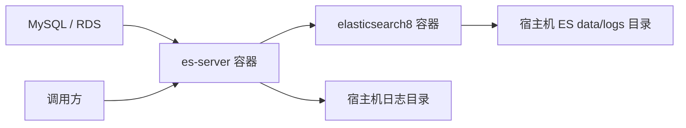

# 部署文档

## 1. 文档说明

本文档用于说明 `es-server` 和 Elasticsearch 8 的构建、部署、启动、检查、日志、运维和常见问题处理。

当前部署模型：

- Elasticsearch 8 单节点。
- `es-server` 单实例。
- 两个服务通过同一个 Docker 网络互通。
- MySQL 使用外部数据库。
- 日志挂载到宿主机目录。

## 2. 目录说明

项目根目录：

```text
C:\work\opts\sano\code\datahub
```

核心目录：

```text
datahub
├── elasticsearch8
│   └── docker-compose-elasticsearch.yml
└── es-server
    ├── Dockerfile
    ├── docker-compose.yml
    ├── docker-build.bat
    ├── docker-build.sh
    ├── deploy-es-server.sh
    ├── logs
    └── src
```

Linux 服务器建议目录：

```text
/home/ec2-user/datahub
├── elasticsearch8
└── es-server
```

## 3. 部署拓扑



Docker 网络：

```text
sano-net
```

服务访问关系：

| 来源 | 目标 | 地址 |
| --- | --- | --- |
| 宿主机 | es-server | `http://127.0.0.1:8002` |
| 宿主机 | Elasticsearch | `http://127.0.0.1:9201` |
| es-server 容器 | Elasticsearch 容器 | `http://elasticsearch8:9200` |

## 4. 服务器建议

当前 8 核 16G 服务器，同时还有其他低负载服务时，建议配置：

| 服务 | CPU 限制 | 内存限制 | JVM 堆 |
| --- | --- | --- | --- |
| Elasticsearch | `4.0` | `8g` | `4g` |
| es-server | `2.0` | `2g` | `1g-1536m` |

这样可以为系统和其他服务预留约 1/4 到 1/3 的资源。

如果后续多表并发导入或查询压力提升，优先将 ES 独立到更高配置服务器，再考虑提升应用并发。

## 5. 部署前准备

### 5.1 安装 Docker

服务器需要安装：

- Docker Engine。
- Docker Compose 插件或 `docker-compose`。

检查命令：

```bash
docker version
docker compose version
```

如果没有 Docker Compose 插件，可检查旧命令：

```bash
docker-compose version
```

### 5.2 创建 Docker 网络

两个 compose 文件都使用外部网络 `sano-net`。

检查网络：

```bash
docker network ls
docker network inspect sano-net
```

如果不存在，创建：

```bash
docker network create sano-net
```

再次确认：

```bash
docker network inspect sano-net
```

### 5.3 设置 ES 系统参数

Elasticsearch 通常需要：

```bash
sudo sysctl -w vm.max_map_count=262144
```

持久化：

```bash
echo "vm.max_map_count=262144" | sudo tee /etc/sysctl.d/99-elasticsearch.conf
sudo sysctl --system
```

### 5.4 准备目录

Elasticsearch 目录：

```bash
cd /home/ec2-user/datahub/elasticsearch8
mkdir -p data logs config plugins backup
```

es-server 日志目录：

```bash
cd /home/ec2-user/datahub/es-server
mkdir -p logs
```

容器内应用默认使用非 root 用户 `10001:10001`，日志目录建议授权：

```bash
sudo chown -R 10001:10001 logs
sudo chmod 755 logs
```

## 6. Elasticsearch 部署

### 6.1 Compose 文件

文件位置：

```text
elasticsearch8/docker-compose-elasticsearch.yml
```

关键点：

- 镜像：`docker.elastic.co/elasticsearch/elasticsearch:8.19.16`
- 容器名：`elasticsearch8`
- 宿主机端口：`9201 -> 9200`、`9301 -> 9300`
- 容器网络：`sano-net`
- 单节点：`discovery.type=single-node`
- JVM 堆：`-Xms4g -Xmx4g`
- Docker 日志限制：`max-size=100m`、`max-file=5`

### 6.2 启动 ES

```bash
cd /home/ec2-user/datahub/elasticsearch8
docker compose -f docker-compose-elasticsearch.yml -p elasticsearch8 up -d
```

如果服务器使用旧版 Compose：

```bash
docker-compose -f docker-compose-elasticsearch.yml -p elasticsearch8 up -d
```

### 6.3 检查 ES

查看容器：

```bash
docker ps --filter "name=elasticsearch8"
```

查看日志：

```bash
docker logs -f elasticsearch8
```

宿主机访问：

```bash
curl -u elastic:你的密码 http://127.0.0.1:9201
curl -u elastic:你的密码 http://127.0.0.1:9201/_cluster/health?pretty
```

容器网络访问：

```bash
docker run --rm --network sano-net curlimages/curl:latest \
  curl -u elastic:你的密码 http://elasticsearch8:9200/_cluster/health?pretty
```

## 7. es-server 构建

### 7.1 本地构建 jar

进入项目：

```bash
cd /home/ec2-user/datahub/es-server
mvn -q -DskipTests clean package
```

Windows：

```bat
cd C:\work\opts\sano\code\datahub\es-server
mvn -q -DskipTests clean package
```

### 7.2 构建 Docker 镜像

Windows：

```bat
docker-build.bat
docker-build.bat v1.0.3
docker-build.bat v1.0.3 --push
```

Linux / macOS：

```bash
./docker-build.sh
./docker-build.sh v1.0.3
./docker-build.sh v1.0.3 --push
```

说明：

- 不传版本时默认构建 `latest`。
- 传入版本时会同时打版本标签和 `latest` 标签。
- 带 `--push` 时使用 `docker buildx` 构建并推送 `linux/amd64`、`linux/arm64` 多架构镜像。
- 当前镜像仓库为 `lxw13000/sano-es-server`。

### 7.3 验证镜像

```bash
docker image ls lxw13000/sano-es-server
```

查看远程多架构信息：

```bash
docker buildx imagetools inspect lxw13000/sano-es-server:v1.0.3
```

## 8. es-server 部署

### 8.1 Compose 文件

文件位置：

```text
es-server/docker-compose.yml
```

关键点：

- 镜像：`${ES_SERVER_IMAGE:-lxw13000/sano-es-server}:${ES_SERVER_IMAGE_TAG:-latest}`
- 容器名：`sano-es-server`
- 宿主机端口：`8002 -> 8002`
- 容器网络：`sano-net`
- 日志挂载：`./logs:/app/logs/es-server`
- Docker 日志限制：`max-size=100m`、`max-file=5`
- 生产环境 profile：`SPRING_PROFILES_ACTIVE=prod`

### 8.2 环境变量

建议在服务器通过环境变量或 `.env` 管理敏感配置。

常用变量：

| 变量 | 含义 |
| --- | --- |
| `ES_SERVER_IMAGE` | 镜像名，默认 `lxw13000/sano-es-server` |
| `ES_SERVER_IMAGE_TAG` | 镜像版本，默认 `latest` |
| `MYSQL_UNM` | MySQL 用户名 |
| `MYSQL_PWD` | MySQL 密码 |
| `ES_URIS` | ES 地址，容器部署建议 `elasticsearch8:9200` |
| `ES_USERNAME` | ES 用户名 |
| `ES_PASSWORD` | ES 密码 |
| `IMPORT_NOTIFY_ENABLED` | 是否开启导入通知 |
| `LARK_NOTIFY_ENABLED` | 是否开启 Lark 通知 |
| `LARK_WEBHOOK_URL` | Lark Webhook |
| `LARK_WEBHOOK_SECRET` | Lark 签名密钥 |
| `DINGTALK_NOTIFY_ENABLED` | 是否开启钉钉通知 |
| `DINGTALK_WEBHOOK_URL` | 钉钉 Webhook |
| `DINGTALK_WEBHOOK_SECRET` | 钉钉签名密钥 |

示例：

```bash
export ES_SERVER_IMAGE_TAG=v1.0.3
export MYSQL_UNM=admin
export MYSQL_PWD='你的MySQL密码'
export ES_URIS=elasticsearch8:9200
export ES_USERNAME=elastic
export ES_PASSWORD='你的ES密码'
```

### 8.3 手动启动

```bash
cd /home/ec2-user/datahub/es-server
docker compose -f docker-compose.yml -p sano-es-server up -d
```

指定版本：

```bash
ES_SERVER_IMAGE_TAG=v1.0.3 docker compose -f docker-compose.yml -p sano-es-server up -d
```

旧版 Compose：

```bash
ES_SERVER_IMAGE_TAG=v1.0.3 docker-compose -f docker-compose.yml -p sano-es-server up -d
```

### 8.4 使用部署脚本

脚本位置：

```text
es-server/deploy-es-server.sh
```

首次授权：

```bash
chmod +x deploy-es-server.sh
```

默认拉取并部署 `latest`：

```bash
./deploy-es-server.sh
```

指定版本：

```bash
ES_SERVER_IMAGE_TAG=v1.0.3 ./deploy-es-server.sh
```

脚本流程：

1. 检查 Docker 和 Compose。
2. 检查或创建 `sano-net` 网络。
3. 创建并授权 `logs` 目录。
4. 停止旧容器。
5. 删除旧容器。
6. 删除本地旧镜像。
7. 拉取目标镜像。
8. 使用 Compose 重新拉起服务。
9. 等待 Docker healthcheck 变为 `healthy`。
10. 再观察一段时间，确认没有再次重启。

## 9. 启动后检查

### 9.1 容器状态

```bash
docker ps --filter "name=sano-es-server"
docker inspect sano-es-server \
  --format 'status={{.State.Status}} running={{.State.Running}} restarting={{.State.Restarting}} restartCount={{.RestartCount}} health={{if .State.Health}}{{.State.Health.Status}}{{else}}none{{end}}'
```

期望：

```text
running=true
restarting=false
health=healthy
```

### 9.2 健康检查

```bash
curl http://127.0.0.1:8002/health
```

期望返回：

```text
OK
```

### 9.3 查看日志

Docker stdout：

```bash
docker logs -f sano-es-server
```

应用日志：

```bash
tail -f logs/$(date +%Y%m%d)/es-server.log
tail -f logs/$(date +%Y%m%d)/es-server-import.log
tail -f logs/$(date +%Y%m%d)/es-server-import-error.log
tail -f logs/$(date +%Y%m%d)/es-server-search-api.log
```

## 10. 初始化任务索引

任务索引 `sano_import_task` 不建议每次启动自动创建。

首次部署或任务索引被删除后，手动调用一次：

```bash
curl "http://127.0.0.1:8002/import/createImportTaskIndex"
```

如果索引已存在，该接口可能提示已存在。正常生产环境不需要重复调用。

## 11. 导入操作

### 11.1 定时导入

生产配置通过：

```yaml
sano:
  es:
    import:
      task-enabled: true
      cron: "0 0 3 * * ?"
```

每天触发后会为昨天的数据创建任务并执行。

### 11.2 手动补一天

```bash
curl "http://127.0.0.1:8002/import/importAppointDay?date=20260703"
```

日期格式：

```text
yyyyMMdd
```

### 11.3 手动补日期段

```bash
curl "http://127.0.0.1:8002/import/importDateRange?startDate=20260701&endDate=20260705"
```

说明：

- `startDate` 和 `endDate` 可以相等。
- 结束日期不能是未来日期。
- 接口会创建日期段内所有启用表的任务。
- 任务仍然由统一调度流程串行执行。
- 如果达到 `max-run-minutes`，剩余任务会保留为 `PENDING` 或 `TIMEOUT_PARTIAL`，下一次继续。

## 12. 网络检查

### 12.1 检查网络是否存在

```bash
docker network ls | grep sano-net
docker network inspect sano-net
```

### 12.2 检查容器是否加入网络

```bash
docker inspect elasticsearch8 --format '{{json .NetworkSettings.Networks}}'
docker inspect sano-es-server --format '{{json .NetworkSettings.Networks}}'
```

### 12.3 从 es-server 容器访问 ES

```bash
docker exec -it sano-es-server sh
curl -u elastic:你的密码 http://elasticsearch8:9200/_cluster/health?pretty
```

如果容器内没有 curl，可以使用临时容器：

```bash
docker run --rm --network sano-net curlimages/curl:latest \
  curl -u elastic:你的密码 http://elasticsearch8:9200/_cluster/health?pretty
```

### 12.4 检查端口监听

```bash
docker port sano-es-server
docker port elasticsearch8
```

期望：

```text
sano-es-server: 8002/tcp -> 0.0.0.0:8002
elasticsearch8: 9200/tcp -> 0.0.0.0:9201
```

## 13. 日志与磁盘控制

### 13.1 Docker 日志限制

两个 Compose 文件都应保留：

```yaml
logging:
  driver: "json-file"
  options:
    max-size: "100m"
    max-file: "5"
```

该配置用于避免 Docker json 日志无限增长导致磁盘占满或服务器假死。

### 13.2 应用日志滚动

应用日志由 `logback-spring.xml` 控制：

- 按日期目录输出。
- 按大小滚动压缩。
- 文件编码 UTF-8。
- 生产保留周期由 `application-prod.yml` 中 `sano.log` 控制。

### 13.3 重点日志文件

| 文件 | 作用 |
| --- | --- |
| `es-server-import.log` | 查看导入进度、MySQL 读取耗时、Bulk 耗时 |
| `es-server-import-error.log` | 查看失败表名和失败 ID |
| `es-server-search-api.log` | 查看查询接口耗时 |
| `es-server-error.log` | 查看应用 ERROR |

## 14. 常用运维命令

### 14.1 查看容器

```bash
docker ps
docker ps -a
```

### 14.2 重启服务

```bash
docker restart sano-es-server
docker restart elasticsearch8
```

### 14.3 停止服务

```bash
docker compose -f docker-compose.yml -p sano-es-server stop
docker compose -f docker-compose-elasticsearch.yml -p elasticsearch8 stop
```

### 14.4 删除 es-server 容器

```bash
docker rm -f sano-es-server
```

### 14.5 查看资源

```bash
docker stats
docker stats sano-es-server elasticsearch8
```

### 14.6 查看镜像

```bash
docker image ls lxw13000/sano-es-server
docker image ls docker.elastic.co/elasticsearch/elasticsearch
```

## 15. 常见问题

### 15.1 es-server 显示 unhealthy

检查：

```bash
docker logs --tail 200 sano-es-server
curl http://127.0.0.1:8002/health
docker inspect sano-es-server \
  --format 'status={{.State.Status}} health={{if .State.Health}}{{.State.Health.Status}}{{else}}none{{end}} restartCount={{.RestartCount}}'
```

常见原因：

- 应用启动失败。
- `/health` 接口不可访问。
- 端口配置不一致。
- 容器反复重启。
- MySQL 或 ES 配置导致 Spring 启动失败。

### 15.2 日志目录无法创建或写入

现象：

```text
Failed to create parent directories
FileNotFoundException: /app/logs/es-server/...
```

处理：

```bash
cd /home/ec2-user/datahub/es-server
mkdir -p logs
sudo chown -R 10001:10001 logs
sudo chmod 755 logs
```

### 15.3 拉取镜像提示 arm64 manifest 不存在

现象：

```text
no matching manifest for linux/arm64/v8
```

处理：

- 使用 `docker-build.bat v版本 --push` 或 `docker-build.sh v版本 --push` 构建多架构镜像。
- 确认远程镜像包含 `linux/arm64`。

检查：

```bash
docker buildx imagetools inspect lxw13000/sano-es-server:版本
```

### 15.4 Docker build 推送卡住

常见原因：

- Docker Desktop 代理不稳定。
- Docker Hub 网络链路中断。
- buildx 推送多架构镜像时上传层较慢。

处理建议：

- 检查 `docker info | grep -i Proxy`。
- 确认 Docker Desktop 代理配置与 Clash 实际监听端口一致。
- 如本地能访问 Docker Hub，但 Docker daemon 不能访问，优先修正 Docker daemon 代理。
- 网络不稳定时重新执行构建推送，Docker 通常会复用已上传层。

### 15.5 Maven 在 Docker build 中下载依赖失败

当前 Dockerfile 已调整为运行镜像，只复制宿主机 Maven 构建好的 jar。

正确流程：

```bash
mvn -q -DskipTests clean package
docker build -t lxw13000/sano-es-server:latest .
```

不要在 Docker build 阶段依赖容器内 Maven 下载依赖。

### 15.6 导入时提示索引已存在

可能原因：

- 同一天同一张表任务重复启动。
- 上一次任务已经创建索引但失败。
- 手动重复调用了同一天导入。

当前正常流程应通过 `sano_import_task` 任务状态续跑，不建议绕过任务系统直接重复创建索引。

处理时先查任务状态和索引：

```bash
curl -u elastic:你的密码 "http://127.0.0.1:9201/sano_import_task/_search?pretty"
curl -u elastic:你的密码 "http://127.0.0.1:9201/_cat/indices/sano_wallet_*?v"
```

### 15.7 任务长时间 RUNNING

下一次调度开始前会修复超时 `RUNNING` 任务为 `TIMEOUT_PARTIAL`。

如果需要人工确认：

```bash
curl -u elastic:你的密码 "http://127.0.0.1:9201/sano_import_task/_search?pretty"
```

重点查看：

- `status`
- `updated_at`
- `last_success_id`
- `last_error`

### 15.8 中文日志乱码

应用文件日志已按 UTF-8 输出。

如果终端看到乱码，优先检查查看工具编码：

```bash
locale
```

建议使用 UTF-8 环境查看日志。

## 16. 生产配置建议

### 16.1 es-server

建议：

- `SPRING_PROFILES_ACTIVE=prod`
- `JAVA_OPTS=-Xms1g -Xmx1536m`
- `mem_limit=2g`
- `cpus=2.0`
- `MYSQL`、`ES`、`Webhook` 等敏感信息通过环境变量注入。

### 16.2 Elasticsearch

建议：

- 单节点使用 `number_of_replicas=0`。
- JVM 堆设置为容器内存的一半左右，当前为 4G。
- 数据目录和日志目录挂载到宿主机。
- 保持 Docker json-file 日志滚动限制。

### 16.3 导入参数

当前生产参数适合 8 核 16G 单机：

```yaml
read-batch-size: 15000
worker-count: 4
queue-capacity: 16
bulk-actions: 3000
bulk-size-mb: 8
retry-times: 3
max-run-minutes: 480
```

调优顺序建议：

1. 先看 `mysql page query costMs`。
2. 再看 `bulk progress costMs` 和 `slow bulk`。
3. 再看 ES CPU、磁盘 IO、GC。
4. 最后再调整批次和线程数。

## 17. 升级发布流程

推荐流程：

```bash
cd /home/ec2-user/datahub/es-server
git pull
mvn -q -DskipTests clean package
./docker-build.sh v1.0.4 --push
ES_SERVER_IMAGE_TAG=v1.0.4 ./deploy-es-server.sh
```

发布后检查：

```bash
docker ps --filter "name=sano-es-server"
curl http://127.0.0.1:8002/health
tail -f logs/$(date +%Y%m%d)/es-server.log
```

## 18. 回滚流程

如果新版本异常，可部署上一版本：

```bash
cd /home/ec2-user/datahub/es-server
ES_SERVER_IMAGE_TAG=v1.0.3 ./deploy-es-server.sh
```

脚本会重新拉取指定镜像并等待健康检查通过。

## 19. 备份建议

### 19.1 ES 数据

业务索引可由 MySQL 重新同步，但重建成本较高。

建议至少保留：

- ES 数据目录快照或磁盘备份。
- `sano_import_task` 任务索引。
- `esmapping` 文件版本。

### 19.2 配置和脚本

需要纳入版本管理：

- `docker-compose-elasticsearch.yml`
- `docker-compose.yml`
- `Dockerfile`
- `deploy-es-server.sh`
- `application-prod.yml`
- `logback-spring.xml`
- `esmapping/*.json`

敏感信息建议通过环境变量管理，不直接写入代码仓库。

## 20. 首次上线检查清单

```text
[ ] Docker 已安装
[ ] Docker Compose 可用
[ ] sano-net 网络已创建
[ ] vm.max_map_count 已设置
[ ] ES data/logs/config/plugins/backup 目录已创建
[ ] ES 已启动并可访问
[ ] es-server logs 目录已创建并授权给 10001:10001
[ ] es-server 镜像已构建并推送
[ ] docker-compose.yml 中 ES_URIS 指向 elasticsearch8:9200
[ ] es-server 已启动且 health=healthy
[ ] /health 返回 OK
[ ] sano_import_task 任务索引已创建
[ ] application-prod.yml 中 tables 配置正确
[ ] Mapping 文件存在且与 MySQL 字段匹配
[ ] 导入日志、失败日志、查询日志可以正常写入
[ ] 手动补一天数据测试通过
[ ] 定时任务时间已确认
[ ] 通知开关和 Webhook 已按需配置
```
